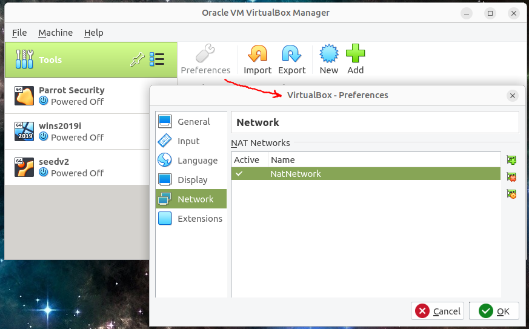

# Setup lab environment

## 1.Description
**In this lab, we will build our own computer security environment using Parrot Security Linux and Windows server 2019**

* Install  [VirtualBox](https://www.virtualbox.org/) on your own PC or laptop. The physical computer you use is called a "Host". The virtual machines that run on it are called "Guests". 
* Create a NAT network and attach all VMs to it.
* Create a virtual machine for Windows server 2019


**Prerequisite:**

Your PC must support virtualization which is popular today, following the section 'Check virtualization availability' in the reference to find its availability and enable it.

* Your own PC or laptop needs more than 100GB free space for these VMs
* If you don't have sufficient free space, you may buy an external USB **3.0+** Flash drive or SSD, for example
  * _USB 3.0+ Flash drive_
    * [Samsung BAR Plus 256GB - 300MB/s USB 3.1 Flash Drive Titan Gray (MUF-256BE4/AM)](https://www.amazon.com/Samsung-BAR-Plus-32GB-MUF-32BE4/dp/B07BPKL2D2?ref\_=fsclp\_pl\_dp\_2&th=1)
    * [SanDisk 256GB Extreme PRO USB 3.1 Solid State Flash Drive - SDCZ880-256G-G46](https://www.amazon.com/dp/B01N7QDO7M/ref=emc\_b\_5\_t)
  * _USB 3.0+  External SSD_
    * [SanDisk 500GB Extreme Portable External SSD - Up to 550MB/s - USB-C, USB 3.1 - SDSSDE60-500G-G25](https://www.amazon.com/SanDisk-500GB-Extreme-Portable-External/dp/B078SWJ3CF/ref=sr\_1\_1?dchild=1&keywords=SanDisk\+500GB\+Extreme\+Portable\+External\+SSD\+-\+Up\+to\+550MB%2Fs\+-\+USB-C%2C\+USB\+3\.1\+-\+SDSSDE60-500G-G25&qid=1588950864&s=electronics&sr=1-1)
    * [Samsung (MU-PA500B/AM)T5 Portable SSD - 500GB - USB 3.1 External SSD , Blue ](https://www.amazon.com/Samsung-T5-Portable-SSD-MU-PA500B/dp/B073GZBT36?ref\_=fsclp\_pl\_dp\_3&th=1)

## 2.Steps
1. (25%) Create a virtual machine for Windows server
   * NAT network settings:
     * Create a NAT network in VirtualBox
     * 
   * VM settings:
     * *2GB to 4GB memory* (Your laptop needs at least 8GB memory)
     * Connect to the NAT network
     * Enable network promiscuous mode
       * Allow communication between all VMs
     * 
   * Demo video: [Create virtual machines for Ubuntu & Windows Server 2019 in VirtualBox 6](https://youtu.be/3PbnBVNWXpk)

2. (20%)Install Parrot Security Linux
Follow the steps below to setup Parrot Security Linux in its VM:

   * (10%) Go to its official website [Parrot Security Linux](https://www.parrotsec.org/download/), download its 64-bit Virtual machine in VirtualBox format - virtualbox (amd64).
   * (10%) Import this VM into VirtualBox. For further information, refer to [its official document](https://www.parrotsec.org/docs/).
     * From menu: File ➡️ Import Appliance
   ```bash
   default username: parrot
   default password: parrot
   ```


1. (25%)Install Windows server

   * (5%)Download [Windows Server 2019 VHD](https://www.microsoft.com/en-us/evalcenter/download-windows-server-2019)
   * (20%)Create a VM and add this Windows server VHD to the VM
   * 
   * Extending the Trial Period (If you have an old one)
     In Powershell, execute this command to see how many days you have left in your trial:

     slmgr -dlv

     Execute this command to extend the trial for another 180 days:

     slmgr -rearm

     You can extend the trial six times, for up to three years.

2. (30%) Show the NAT network is working
	 * On the Windows Server VM, find its ip configuration of the Ethernet adapter connected to the NAT: 	
    ```cmd
    ipconfig /all
    :: take a note of your Windows VM IP address
    ```
	 * On the Parrot Security Linux VM, find its ip configuration of the Ethernet adapter connected to the NAT: 	
    ```bash
    ifconfig -a
    :: take a note of your Parrot Security Linux VM IP address
    ```
	 * from the Windows server VM ping the Parrot Security VM
    ```cmd
    ping Parrot // the Parrot ip address noted before
    ```
	 * from the Parrot VM ping the Windows server VM
    ```bash
    ping WindowsIP // the Windows ip address noted before
    ```

**Note**

Please fully update your Parrot at home, it takes a long time.

```bash
sudo apt update
sudo apt upgrade
```


## 3. (10%) Extra credits
- [Join the Cybersecurity Club](https://floridapoly.campuslabs.com/engage/organization/cybersecurity-club)

---

*Optional*

After installation, *make sure you can access Internet*, update and upgrade Parrot, then install the following tools. Open a terminal window, run the following commands:

```bash
# 1. update, upgrade Parrot then install several popular tools
sudo apt update
sudo apt upgrade -y
sudo apt install apt-transport-https dirmngr
sudo apt install p7zip-full build-essential gcc perl cmake automake curl git geany okular vim
```

* Install [VirtualBox Guest Additions in the guest Parrot Linux](https://www.parrotsec.org/docs/virtualization/virtualbox-guest-additions).


## References
* *Projects from samsclass*
  * [Project 1: Kali Virtual Machine](https://samsclass.info/152/proj/123p1kali.htm)
    * [katoolin3](https://github.com/s-h-3-l-l/katoolin3)
  * [Project 2: Windows 2016 Server Virtual Machine](https://samsclass.info/123/proj10/123p2win.htm)
* *Check virtualization availability*
  * [Linux Find Out If CPU Support Intel VT/AMD-V Virtualization For KVM](https://www.cyberciti.biz/faq/linux-xen-vmware-kvm-intel-vt-amd-v-support/)
  * [Easy Ways to Check If Your Processor Supports Virtualization](https://www.technorms.com/8208/check-if-processor-supports-virtualization)
  * [How to find out if Intel VT-x or AMD-V virtualization technology is supported?](https://www.auslogics.com/en/articles/how-to-find-out-if-intel-vt-x-or-amd-v-virtualization-technology-is-supported/)
  * [How to check if Intel Virtualization is enabled without going to BIOS in Windows 10](https://stackoverflow.com/questions/49005791/how-to-check-if-intel-virtualization-is-enabled-without-going-to-bios-in-windows)
  * [How to Enable Intel VT-x in Your Computer’s BIOS or UEFI Firmware](https://www.howtogeek.com/213795/how-to-enable-intel-vt-x-in-your-computers-bios-or-uefi-firmware/)
  * [Virtualization (VT-x/AMD-V) - Enabling virtualization on your computer for running 2N® Access Commander](https://2nwiki.2n.cz/pages/viewpage.action?pageId=75202968)
* *For Mac computers with ARM processor such as m1/m1*
  * [Developer preview for macOS / Arm64 (M1/M2) hosts](https://www.virtualbox.org/wiki/Download_Old_Builds_7_0)
  * [How To Install Parrot OS on Mac M1?](https://minkcoregame.medium.com/how-to-install-parrot-os-on-mac-m1-c1f20438631)
    * [Securely run ANY operating systems on your Mac m1](https://mac.getutm.app/)
* *VM manager*
  * [VMware Workstation Player](https://www.vmware.com/products/workstation-player.html)
    * [Promiscuous Mode by Default?](https://communities.vmware.com/t5/VMware-Workstation-Pro/Promiscuous-Mode-by-Default/td-p/2717392)
    * [Using Virtual Ethernet Adapters in Promiscuous Mode on a Linux Host](https://kb.vmware.com/s/article/287)
  * [VirtualBox](https://www.virtualbox.org/)
  * [Hyper-V](https://docs.microsoft.com/en-us/virtualization/hyper-v-on-windows/quick-start/enable-hyper-v)
* [Top 21 Operating Systems For Ethical Hacking And Pen Testing](https://techlog360.com/top-ethical-hacking-operating-systems/)
  * [Kali Linux](https://www.kali.org/)
* [Linux distribution](https://en.wikipedia.org/wiki/Linux_distribution)
  * [List of Linux distributions](https://en.wikipedia.org/wiki/List_of_Linux_distributions)
  * [Comparison of Linux distributions](https://en.wikipedia.org/wiki/Comparison_of_Linux_distributions)
  * [Light-weight Linux distribution](https://en.wikipedia.org/wiki/Light-weight_Linux_distribution)
* [Windows Server evaluation center](https://www.microsoft.com/en-us/evalcenter/evaluate-windows-server)
* *command line basics*
  * [Linux journey](https://linuxjourney.com/)
  * [Windows commands cheatsheet](./commandCheatsheets/CommandPromptCheatsheet.pdf)
  * [Linux commands cheatsheet](./commandCheatsheets/LinuxCommandMemento.pdf)
* _old os_
  * [WinWorld](https://winworldpc.com/library/operating-systems)
  * [Old versions of Linux](https://soft.lafibre.info/)
  * [archiveos](https://archiveos.org/)
* [Install Kali on VMware](https://samsclass.info/152/proj/M108.htm)
* [Kali Linux and Windows server 2012 VMs](https://drive.google.com/drive/folders/1fT7DlwAQjaDjCRsDDSDtaYZU2sCSLa_v)
  * Windows user/pass: Lab250/toor, Administrator/Admin123
  * Kali user/pass: root/toor
* [Immersive learning games](https://drive.google.com/drive/folders/1lrMrlt7txA1VviePt4koUjyxB6nedtLg)