# Introduction to computer security
ch1

Information Assurance and Cybersecurity
---
Concentration courses and career path:
- CIS 4367 - Computer Security Credits: 3
  - Security Analyst
- CIS 4362 - Applied Cryptography Credits: 3
  - Cryptographer    
- CIS 4203 - Digital Forensics Credits: 3
  - Digital Forensics examiner
- CIS 4204 - Ethical Hacking Credits: 3
  - Ethical Hacker

Certification
---
- [Certified in Cybersecurity - CC](https://www.isc2.org/Certifications/CC)
- [Certified Information Systems Security Professional](https://www.isc2.org/Certifications/CISSP)
- [Certified Ethical Hacker](https://www.eccouncil.org/train-certify/certified-ethical-hacker-ceh-v12/)
- [Digital Forensics Certifications](https://www.sans.org/cyber-security-certifications/digital-forensics-certifications/)

Practice 🖊️
---
- [Explore the cybersecurity job market](https://www.cyberseek.org/heatmap.html)

Practice 🖊️
---
Explore Cybersecurity competitions
- [Collegiate Penetration Testing Competition (CPTC)](https://cp.tc/)
- [Collegiate Cyber Defense Competition (CCDC)](https://www.nationalccdc.org/)
- [National Cyber League (NCL)](https://nationalcyberleague.org/)

Practice 🖊️
---
Prepare for the competitions
- [How to start a student organization](https://floridapoly.edu/student-affairs/student-development/clubs-organizations/index.php)
  - [Join the Cybersecurity Club](https://floridapoly.edu/news/articles/2021/10/102521-cybersecurityclub.php)
- *Hone your skills*
  - [TryHackMe](https://tryhackme.com/)
  - [picoCTF](https://picoctf.org/)
  - [HackTheBox](https://www.hackthebox.com/)

The 6 components of [information system](https://en.wikipedia.org/wiki/Information_system)
---
- Hardware, Software, Data
- Internet
- Procedure
- People

Practice 🖊️
---
- Describe the 6 components of the following information systems
  - University website
  - Canvas 

What is computer security?
---
- It is about [information security](https://csrc.nist.gov/glossary/term/information_security)
- The protection of information and information systems 
- Avoid unauthorized access, use, disclosure, disruption, modification, or destruction of digital assets
- Provide confidentiality, integrity, and availability - the CIA triad

Information security attributes and protection
---
- 
- the CIA composed in hardware, software and communication
- protection and prevention at three layers: physical, personal and organizational

CIA triad
---

- Confidentiality
  - preserves authorized restrictions on information access and disclosure
  - protects personal privacy and proprietary information
  - *break: information leaked*
- Integrity
  - guards against improper information modification or destruction
  - assures system integrity or soundness
  - ensures information non-repudiation and authenticity
  - *break: information corrupted*
- Availability
  - ensures timely and reliable access to and use of information
  - *break: degraded or unavailable*
- Authenticity
  - identity setup and verification
- Accountability
  - or non-repudiation, keeps every activity traceable

How to [measure the breach of CIA qualitatively](https://csrc.nist.gov/pubs/fips/199/final)?
---
Levels of Impact on organizational operations, assets, or individuals
- Low: a limited adverse effect
- Moderate: a serious adverse effect
- High: a severe or catastrophic adverse effect 

A model for computer security
---

System resources or assets
---
- hardware, software and data
- communication facilities and networks

Vulnerability, threat and attack
---
- A vulnerability is a weak point of a system
- A threat is a potential security harm to an asset
- An attack is a threat in action

Attack surfaces
---
- Reachable and exploitable vulnerabilities in a system
  - Network attack surface
    - open ports and services
  - Software attack surface
    - code receiving and processing inputs
  - Human attack surface
    - employees vulnerable to social engineering attacks

Attack surface analysis
---
- assesses the scale and severity of threats to a system
- assisted with an attack tree 
  - represents a set of optional techniques for exploiting vulnerabilities

Attack types
---
- Active attack
  - replay
  - masquerade (spoof)
  - tamper
  - denial of service (DoS)
- Passive attack
  - sniff
- Inside attack
- Outside attack

Attacks vs. Consequences
---
- Attacks (threat actions) engender threat consequences

| Attack | Consequence | CIA break |
| --- | --- | --- |
| • Exposure • Interception • Inference • Intrusion | • Unauthorized disclosure | Confidentiality |
| • Masquerade • Falsification • Repudiation | • Deception | System integrity or data integrity |
| • Incapacitation • Corruption • Obstruction | • Disruption | Availability of system integrity |
| • Misappropriation  • Misuse | • Usurpation | System integrity |

Practice 🖊️
---
- Explore the Information system below
- Based on your daily experience, describe 
  - the digital assets, 
  - threats, attacks, impacts and 
  - protections
- 

Practice 🖊️
---
- Use a real-world IT system, exemplify threats on the CIA of the 6 components by filling out the table

| component\threat | confidentiality | integrity | availability |
| --- | --- | --- | --- |
| Hardware | | | break |
| Software | | inject virus | |
| Data | | | encrypt by ransomware |
| Procedure |  |  | DoS |
| People |  | betray | |
| Internet | eavesdrop | | |

How to measure the breach of CIA quantitatively?
---
- [Common Vulnerability Scoring System (CVSS)](https://www.first.org/cvss/specification-document)
- [CVSS calculator](https://www.first.org/cvss/calculator/3.1)

How to achieve CIA?
---
Through a structured risk management process that involves: 
- Identify and evaluate 
  - information, related assets and vulnerabilities
  - potential threats, risks and impacts
- Select, design and apply
  - cybersecurity tools to avoid, mitigate, share, or accept the risks
  - intrusion detection and prevention systems

[Security functional requirements](https://csrc.nist.gov/pubs/fips/200/final)
---
- Planning (PL)
  - System and Services Acquisition (SA)
  - Risk Assessment (RA)
  - Contingency Planning (CP)
- Access Control (AC)
  - Identification and Authentication (IA)
  - Personnel Security (PS)
  - Audit and Accountability (AU)
  - Configuration Management (CM)
- Maintenance (MA)
  - Media Protection (MP)
  - Physical and Environmental Protection (PE)
  - System and Communications Protection (SC)
  - System and Information Integrity (SI)
  - Awareness and Training (AT)
  - Incident Response (IR)
  - Certification, Accreditation, and Security Assessments (CA)

[Fundamental security design principles](https://dl.dod.cyber.mil/wp-content/uploads/cae/pdf/unclass-cae-cd_ku.pdf)
---
- Isolation
  - Separation (of domains): Least common mechanism
  - Separation of privilege: multiple privilege attributes are required to access restricted resources
  - Modularity
  - Layering
  - Encapsulation
- Simplicity (of design)
  - Least Privilege
  - Minimization (of implementation)
  - Reduce attack surfaces
  - Least Astonishment
  - Economy of mechanism: the security solution must be affordable
- Usability
  - Fail Safe Defaults / Fail Secure: access is denied by default
  - Complete mediation: every access must be checked with the access control mechanism
  - Psychological acceptability
- Open Design: transparent and open to public scrutiny

Computer Security Strategy
---
- Security policy or specification: what to do?
  - User friendliness vs. Security
  - Cost of security vs. Cost of failure and recovery
- Security mechanism or implementation: how?
  - with [NIST Cybersecurity Framework functions](https://nvlpubs.nist.gov/nistpubs/CSWP/NIST.CSWP.29.ipd.pdf)
    - 
- Assurance and evaluation: will it work?
  - confidence about the security
  - not mathematical or formal proof

[Cybersecurity Standards and Frameworks](https://www.itgovernanceusa.com/cybersecurity-standards)
---
- [National Institute of Standards and Technology (NIST) cybersecurity](https://www.nist.gov/cybersecurity)
- [Internet Engineering Task Force (IETF) Security & privacy](https://www.ietf.org/topics/security/)
- [Information and communications technology (ICT) Security Standards Roadmap](https://www.itu.int/en/ITU-T/studygroups/com17/ict/Pages/default.aspx)
- [Security-Related Requests for Comments (RFCs) and Mitre Nomenclature Projects](https://cromwell-intl.com/cybersecurity/rfcs.html)
- [ISO/IEC 27001 Information security management systems](https://www.iso.org/standard/27001)

Practice 🖊️
---
- Explore the Cybersecurity Standards and Frameworks above

Basic Linux and Windows commands
---
- [basic commands](./cmd.md)

# References
- [FIPS 200: Minimum Security Requirements for Federal Information and Information Systems](https://csrc.nist.gov/pubs/fips/200/final)
- [Fundamental Security Design Principles](https://binaryterms.com/fundamental-security-design-principles.html)