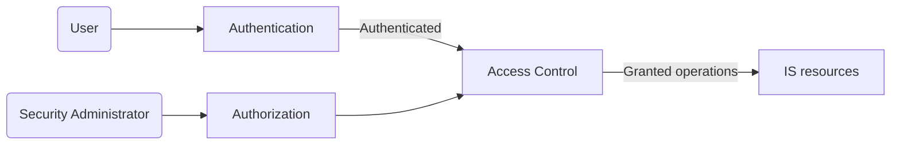
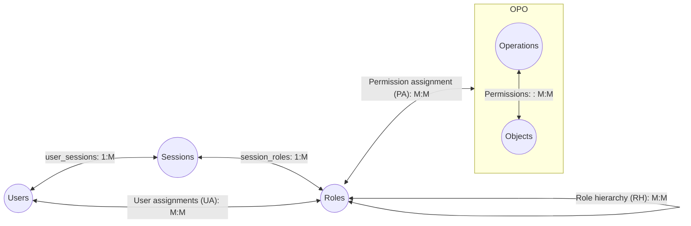
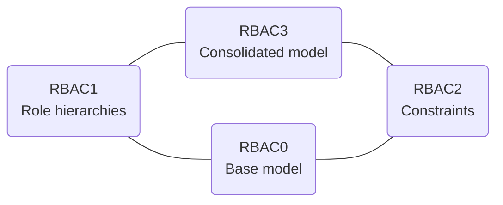

# [Access Control (AC)](https://en.wikipedia.org/wiki/Access_control)

What can you do in an information system (IS)?
---
- [FIPS 201-3 definition](https://csrc.nist.gov/glossary/term/access_control)
  - *granting or denying specific requests* to 
    - obtain and use information and related services 
    - enter specific physical facilities
- [RFC 4949 definition](https://www.rfc-editor.org/rfc/rfc4949)
  - regulates use of system resources according to a security policy 
  - permits only to authorized entities


## Access Control Principles

🖊️ Practice
---
- Computer security is maily about access control
- Explore [TABLE D-1: MAPPING ACCESS CONTROL REQUIREMENTS TO CONTROLS](https://nvlpubs.nist.gov/nistpubs/SpecialPublications/NIST.SP.800-171r2.pdf) in NIST SP 800-171 for
  - Basic AC security requirements
  - Derived AC security requirements


Access Control Context
---

- All activities are under audit


## Subjects access objects with certain access rights


Subject
---
- an entity capable of accessing objects
- the process that represents user or application
  - takes on the attributes of the user, such as access rights
-  is typically held accountable for its actions
   -  the actions may be recorded by an audit trail 
- belongs to one of three classes with different access rights
  - owner of the IS resources
  - group with identical access rights for each member
    - a user may belong to multiple groups
  - world (others) includes anyone other than owner and group
    - have least amount of access


Objects
---
- an IS resource under access control
- contains information, such as
  - files, directories
  - records, blocks, tables, databases
  - pages, segments, devices
  - messages, mailboxes, programs


Access Rights
---
- the operations that a subject can do on an object
- typical access rights
  - create, delete
  - read, write
  - search, execute


Access Control Policies
---
- integrated in authorization systems
- dictate what types of access are permitted, under what circumstances, and by whom
- include four typical categories
  - Discretionary access control (DAC)
    - by the requestor's volition
  - Mandatory access control (MAC)
    - by the requestor's clearance
  - Role-based access control (RBAC)
    - by the requestor's roles
  - Attribute-based access control (ABAC)
    - by related attributes of the requestor, resources and environmental conditions
- these categories are not mutually exclusive


[Discretionary Access Control (DAC)](https://en.wikipedia.org/wiki/Discretionary_access_control)
---
- restricts access to objects based on 
  - the identity of subjects
  - groups to which they belong
- allow pass of access rights to other subjects
- implemented in [access matrix (table)](https://en.wikipedia.org/wiki/Access_control_matrix) $A[s_i,r_j]$ with
  - left-most column of subjects $s_i$
  - head row of resources $r_j$
  - cells of access rights $a_{s_i,r_j}$


A access matrix
---
| S/A/R | Resource 1 | Resource 2 | Resource 3 |
| --- | --- | --- | --- |
| Subject 1 |  | read | own |
| Subject 2 | read<br>write | | write |
| Subject 3 | read | | read<br>write |


Access control list(ACL) and capability ticket
---
- each column $r_j$ is an **access control list(ACL)**
  - lists subjects and their access rights on this resource
  - unlisted subjects are assigned a default set of rights
  - convenient to determine which subjects have which access rights to a specified resource
  - hard to determine all access rights for a particular subject
- each row $s_i$ is a **capability ticket**
  - specifies authorized objects and operations for a particular subject
  - convenient to determine the set of access rights for a given subject
  - can be given to other subjects
  - must be unforgeable. How?
    - let the OS hold  all tickets on behalf of subjects
    - add a message authentication code (MAC) to each ticket
      - the MAC is verified by the relevant resource whenever access is requested
  - hard to determine subjects and their access rights on a given resource


Authorization table
---
- like access matrix but not sparse
- each row specifies one access right of one subject to one resource
  - sorting the table by subject gives capability lists
  - sorting the table by resource gives access control lists
- can be easily implemented with relational database


[Graham–Denning model](https://en.wikipedia.org/wiki/Graham%E2%80%93Denning_model)
---
- extended from DAC model to 
  - a general model 
  - associates capabilities with protection domains, such as
    - user domain (user mode)
    - kernel domain (kernel mode)
- assumes
  - a set of subjects
  - a set of objects
    - processes, devices, memory locations or regions, *subjects*
  - a set of rules that govern the access of subjects to /objects
- defines a protection state as a snapshot of the access control matrix $A$
  - $A[S,X]$ : a string represents access attributes
    - specify the access rights of subject $S$ to object $X$


An access control matrix
---
- the star ⋆ is a copy flag, indicates the attribute can be transferred

| S/A/O | S1 | S2 | S3 | File 1 | Process 1 | Device 1 |
| --- | --- | --- | --- | --- | --- | --- |
| S1 |  | control | own | read* | wakeup | owner |
| S2 | control<br>own | |  | write |  | seek* |
| S3 | control | |  | | stop | |


Steps triggered by an access attempt
---
- A subject $S_0$ issues a request $R$ of type $T$ for object $X$
- $R$ triggers the system to generate a message $(S_0, T, X)$ to the access controller
- The controller lookup the access matrix $A$ to see if $T \in A[S_0,X]$ 
  - Yes, access is granted
    - $A$ may be updated by this access. e.g. copy an access right
  - No, access is denied and the violation is recorded and reported

8 access control system commands
---
| Rule | Command (by $S_0$) | Operation |
| --- | --- | --- |
| $R_1$ | transfer {$T^⋆, T$} to $S,X$ | store {$T^⋆, T$} in $A[S,X]$ | 
| $R_2$ | grant {$T^⋆, T$} to $S,X$ | store {$T^⋆, T$} in $A[S,X]$ | 
| $R_3$ | delete $T$ from $S,X$ | delete $T$ from $A[S,X]$ | 
| $R_4$ |  $w ← read\ S,X$ | copy $A[S,X]$  into $w$ | 
| $R_5$ | create object $X$ | add column for $X$ to $A$; store 'owner' in $A[S_0,X]$  | 
| $R_6$ | destroy object $X$ | delete column of $X$ from $A$ |
| $R_7$ | create subject $S$ | add row for $S$ to $A$; create object $S$; store 'control' in $A[S,S]$  | 
| $R_8$ | destroy subject $S$ | delete row of $S$ from $A$; destroy object $S$; |


💡 Demo 
---
- [Traditional UNIX File Access Control](https://en.wikipedia.org/wiki/File-system_permissions)
- subjects: user (owner), group, and other
- objects: files and directories
- access rights: read, write, and execute

```bash
# 1. list permissions of a file
ls -l afile

# 2. list permissions of a directory
ls -ld adirectory

# 3. change permissions
chmod {options} filename
```


🔭 Explore
--- 
- Explore [Access Control Lists (ACLs) in UNIX](https://help.ubuntu.com/community/FilePermissionsACLs)
- Explore [Linux File Permissions: Understanding setuid, setgid, and the Sticky Bit](https://www.cbtnuggets.com/blog/technology/system-admin/linux-file-permissions-understanding-setuid-setgid-and-the-sticky-bit)


[Role-Based Access Control (RBAC)](https://en.wikipedia.org/wiki/Role-based_access_control)
---
- simplifies DAC by abstracting the access rights shared by a group of subjects into role
  - roles have hierarchies
- decouples access rights from subjects
- typically defines a role as a job function within an organization
- a user can be assigned more than one roles statically or dynamically
  - according to the principle of least privileges
- widely used now and required by [FIPS PUB 140-3: Security Requirements for Cryptographic Modules](https://csrc.nist.gov/pubs/fips/140-3/final)
- modelled with two matrixes
  - role assignment matrix assigns subjects with roles 
  - role access rights matrix specifies the access rights of each role on the resources


Access Control Matrix Representation of RBAC
---
- role assignment matrix

| U\R | Role 1 | Role 2 | Role 3 |
| --- | --- | --- | --- |
| User 1 | ✅ |  | ✅ |
| User 2 |  | ✅ | ✅ |

- role access rights matrix

| R/A/O | R1 | R2 | R3 | File 1 | Process 1 | Device 1 |
| --- | --- | --- | --- | --- | --- | --- |
| R1 |  | control | own | read* | wakeup | owner |
| R2 | control<br>own | |  | write |  | seek* |
| R3 | control | |  | | stop | |

### RBAC Reference Models

RBAC models
---



Relationship among RBAC models
---
-  A Family of Role-Based Access Control Models 
   - $RBAC_0$ is the minimum requirement for an RBAC system
     - contains four types of entities: user, role, permission, session
   - $RBAC_1$ adds role hierarchies
     - reflect the hierarchical structure of roles in an organization
   - $RBAC_2$ adds constraints
   - $RBAC_3$ includes RBAC 1 and RBAC 2


Scope RBAC Models
---
| Models | Hierarchies | Constraints |
| --- | --- | --- |
| $RBAC_0$ | No | No |
| $RBAC_1$ | Yes | No |
| $RBAC_2$ | No | Yes |
| $RBAC_3$ | Yes | Yes |


RBAC Constraints 
---
- Means of adapting RBAC to the specifics of administrative and security policies of an organization
- Relationships among roles or conditions related to roles
- Types:
- Mutually exclusive roles
  - A user can only be assigned to one role in the set (either during a session or statically)
  - Any permission (access right) can be granted to only one role in the set
- Cardinality
  - Setting a maximum number of users, permissions for roles
- Prerequisite roles
  - A user can only be assigned to a particular role if it is already assigned to some other specified roles


## Attribute-Based Access Control

### Attributes

### ABAC Logical Architecture

### ABAC Policies

## Identity, Credential, and Access Management

### Identity Management

### Credential Management

### Access Management

### Identity Federation

## Trust Frameworks

### Traditional Identity Exchange Approach

### Open Identity Trust Framework

# References
- [CS 509U: Access Control: Theory and Practice](https://www.cs.purdue.edu/homes/ninghui/courses/Spring06/)
- [Competitive Programming Courses at Purdue Computer Science](https://www.cs.purdue.edu/homes/ninghui/courses/cpx_index.html)