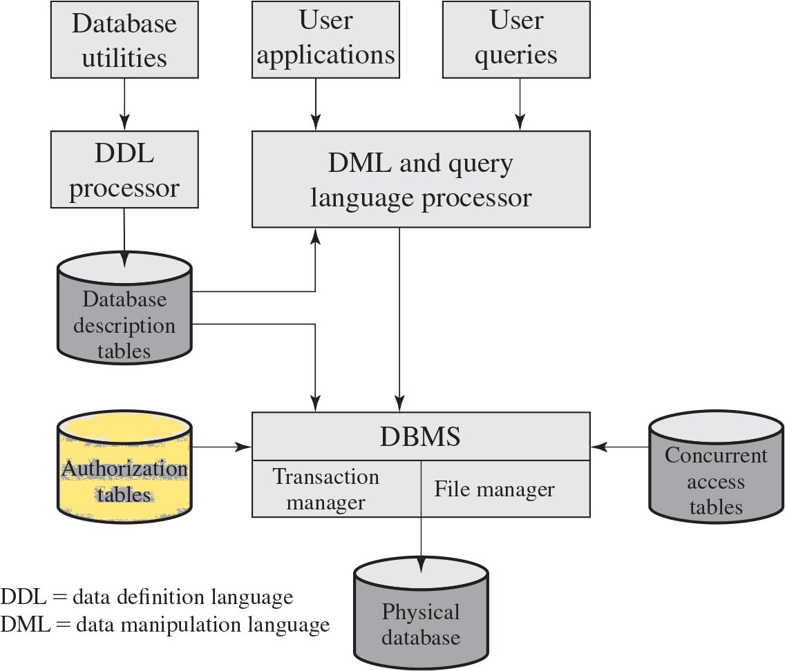
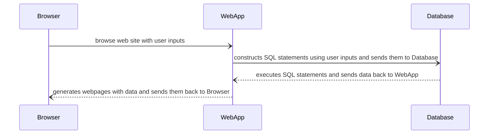
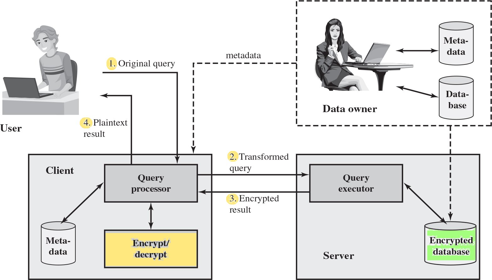

# Database and Data Center Security
ch5

🔭 Explore
---
- [Biggest Data Breaches in US History](https://www.upguard.com/blog/biggest-data-breaches-us)


The Need and Challenge for Database Security
---
- The database is typically the most valuable information resource in an organization
- Organizational databases concentrate sensitive information
  - user credentials, financial data, etc.
- no sufficient protection on complex DBMS consist of a heterogeneous mixture of databases
  - no full-time database security personnel
- DBMS have versatile interaction protocol -  Structured Query Language (SQL)
- part or all of the corporate databases are hosted on cloud
- focuses on relational database management systems (RDBMS)
  - RDBMS dominates database market


Databases and Database Management Systems
---
- Databases
  - Structured collection of data stored for use by users and applications
  - Contain relationships between data items and groups of data items
  - Sometimes contain sensitive data that needs to be secured
- Database management system (DBMS)
  - Suite of programs for constructing and maintaining databases
  - Offers ad hoc query facilities to multiple users and applications
- Query language
  - a uniform interface to databases


DBMS Architecture
---
- 
- two protections
  - OS security mechanisms on 
    - users and processes
  - DBMS builtin security mechanisms on 
    - databases, tables, views, records and stored procedures


Relational Databases
---
- Collections of tables (relations) consisting of rows and columns
  - Each column (field, attributes) holds a particular type of data
    - Ideally has one column where all values are unique, 
      - forming an identifier/key for that row
  - Each row (record, tuple) contains a specific value for each column
- Multiple tables linked together by keys (relationship)
- Use SQL to manipulate and access the database
- Primary key
  - Uniquely identifies a row
  - Consists of one or more column names
- Foreign key
  - Links one table to attributes in another
- View/virtual table
  - Result of a query
  - often used for security purposes


Structured Query Language (SQL)
---
- Standardized language to 
  - define schema, 
  - manipulate, and query data
- Several similar versions of ANSI/ISO standard
- can be used to:
  - Create databases, tables and views
  - Insert and delete data in tables
  - Retrieve data with query statements


A typical 3-tier web application
---

- Web applications vulnerable to SQLi have no sanitization of 
  - user inputs
  - implicit inputs such as 
    - server variables can be changed by HTTP headers
    - website cookies 


SQL Injection (SQLi) Attacks
---
- One of the most prevalent and dangerous network-based security threats
- Designed to exploit the vulnerability of Web application pages
- Sends malicious SQL commands to the database server
- common attack goals
  - extract bulk of data
  - Modify or delete data
  - Execute arbitrary operating system commands
  - Launch denial-of-service (DoS) attacks


🖊️ Explore 
---
- [Typical SQLi Attacks](https://www.w3schools.com/sql/sql_injection.asp)


SQLi Attack vectors
---
- User input fields
- Server variables
  - through HTTP  headers
- website cookies
- Physical user input
  - e.g. barcodes, RFID tags, or even paper forms scanned using optical character recognition (OCR)
- Second-order injection
    - attack from within the system itself triggered by attacker


SQLi Attack types
---
- Categorized based on the relationship between 
  - the SQL command injection channel (IC) and
  - the channel for retrieving results (OC)
- Three types
  - Inband attack 
  - Inferential attack
  - Out-of-Band Attack


Inband attack
---
- Uses the same communication channel for injecting SQL code and retrieving results
- The retrieved data are presented directly in application Web page
- Methods:
  - Tautology
    - injects code in conditional statements so that they always evaluate to true
  - End-of-line comment
    - legitimate code that follows are nullified 
  - Piggybacked queries
    - adds additional queries on top of the legitimate query


Inferential attack
---
- no application Web page for showing the retrieved data
- send particular requests and observe the resulting behavior of the Website
  - e.g. error message
- Methods
  - *Illegal queries*: trial and error
    - find information about the type and structure of the backend database
    - a preliminary, information-gathering step for other attacks
  - *Blind SQL injection*: exhaustion 
    - infer the data present in a database without error feedback


Out-of-Band Attack
---
- Data are retrieved using a different channel
- when there are limitations on information retrieval, 
  - but outbound connectivity from the database server is lax
  - e.g. query results are sent through email


SQLi Countermeasures
---
- Defensive coding
  - Manual defensive coding practices
  - Parameterized query insertion
    - prepared statements
  - SQL DOM
    - a set of classes that enables automated data type validation and escaping
- Detection
  - Signature based
  - Anomaly based
  - Code analysis
- Run-time prevention
  - Check queries at runtime to see if they conform to a model of expected queries


Database Access Control
---
- determines
  - whether a user has access to the entire database or parts of it
  - What access rights the user has 
    - create, insert, delete, update, query
- supports a range of administrative policies
  - Centralized administration
    - Small number of privileged users may grant and revoke access rights
  - Ownership-based administration
    - The creator of a table may grant and revoke access rights to the table
  - Decentralized administration
    - The owner of the table may grant and revoke authorization rights to other users
      - allowing them to grant and revoke access rights to the table


SQL-Based Access Controls
---
- Two commands for managing access rights:
  - Grant
    - grant one or more access rights 
    - assign a user to a role
    ```sql
    GRANT           {privileges | role}
    [ON             table]
    TO              {user | role | PUBLIC}
    [IDENTIFIED BY  password]
    [WITH           GRANT OPTION] -- whether the access rights are transferable
    ``` 
  - Revoke
    - Revokes the access rights
    ```sql
    REVOKE          {privileges | role}
    [ON             table]
    FROM            {user | role | PUBLIC}
    ``` 
- Typical access rights:
  - Select
  - Create, Insert, Update, Delete
  - References
    -  define foreign keys in another table that refer to the specified columns


Cascading Authorizations
---
- The grant option enables an access right to cascade through a number of users
- The revocation of privileges also cascade
  - unless that privileges would exist even if the original grant had never occurred


Role-Based Access Control
---
- capabilities
  - Create and delete roles
  - Define permissions for a role
  - Assign and cancel assignment of users to roles
- Categories of database users:
  - Application owner
    - owns database objects as part of an application
  - End user
    - operates on database objects via a particular application 
    - but does not own any of the database objects
  - Administrator
    - administrates part or all of the database


🔭 Explore
---
- [Using Roles in MySQL](https://dev.mysql.com/doc/refman/8.0/en/roles.html)
- [Server-level roles in MS SQL Server](https://learn.microsoft.com/en-us/sql/relational-databases/security/authentication-access/server-level-roles)


Inference
---
- deduces unauthorized information from the responses of authorized queries 
  - by
    - metadata
    - functional dependencies between attributes within a table or across tables
  - through *inference channel*
    - the information transfer path by which unauthorized data is obtained
  - when a combination of data items
     - is more sensitive than the individual items, or
     - can be used to infer data of higher sensitivity
- can be detected with inference detection algorithm 
  - during database design
    - remove an inference channel by 
      - altering the database structure or 
      - changing the access control regime to prevent inference
    - often results in unnecessarily stricter access controls that reduce availability
  - at query time
    - eliminate inference channel violation from queries
    - deny or alter a query if an inference channel is detected


Database Encryption
---
- Protected by multiple layers of security
  - Firewalls, authentication, general access control systems, DB access control systems, *database encryption*
- Encryption becomes the last line of defense in database security
  - Can be applied to the entire database, the record level, the attribute level
  - Different portions of the database could be encrypted with different keys
- Disadvantages to encryption:
  - Overhead of encryption and decryption
    - encrypted data can only be accessed with the decryption key
  - Inflexibility
    - difficult to search through encrypted records 


A Database Encryption Scheme
---

- straightforward but lacks flexibility
  - e.g. no way to do ordering, statistics, etc.
- a little bit improved by attribute partition with index
  - treat each row $R_i=(a_{i1},a_{i2},⋯,a_{iN})$ as a contiguous binary block $B_i = (a_{i1}‖a_{i2}‖⋯‖a_{iN})$
  - encrypt the block $E(k, B_i)$
  - Create attribute partitions with indexes and associate with each table to assist data retrieval with the mapping $(a_{i1},a_{i2},⋯,a_{iN})⟶ [E(k, B_i), I_{i1}, I_{i2},⋯,I_{iK}], K≪N$
  - This arrangement provides for a little bit efficient data retrieval of several records in the same partition
- hopefully to be solved by [homomorphic encryption](https://en.wikipedia.org/wiki/Homomorphic_encryption)
  - allows computations to be performed on encrypted data as on unencrypted data
  - the result is still in encrypted form, once decrypted, is identical to that produced had the operations been performed on the unencrypted data


🔭 Explore
---
- [Security in MySQL](https://dev.mysql.com/doc/mysql-security-excerpt/8.1/en/)
- [Security for SQL Server Database Engine and Azure SQL Database](https://learn.microsoft.com/en-us/sql/relational-databases/security/security-center-for-sql-server-database-engine-and-azure-sql-database)


Data Center
---
- Data center:
  - An enterprise facility that houses a large number of servers, storage devices, and network switches and equipment
  - The number of servers and storage devices can run into the tens of thousands in one facility
  - Generally includes redundant or backup power supplies, redundant network connections, environmental controls, and various security devices
  - Can occupy one room of a building, one or more floors, or an entire building
- Examples of uses:
  - Cloud service providers
  - Search engines
  - Large scientific research facilities
  - IT facilities for large enterprises


🔭 Explore
---
- [Inside Google's $13 Billion Data Centers](https://youtu.be/9CL3pZfsHbs)


Data Center Security Model
---
| Assets | Secure techniques |
| --- | --- |
| data | Encryption, Password policy, secure IDs, Data Protection (ISO 27002), Data masking, Data retention, etc. |
| network | Firewalls, Anti-virus, Intrusion detection/prevention, authentication, etc. |
| buildings<br>(physical security) | Surveillance, Mantraps, multifactor authentication, Security zones, ISO 27001/27002, etc. |
| site | Setbacks, Redundant utilities Landscaping, Buffer zones, Crash barriers, Entry points, etc. |


🔭 Explore
---
- [Google Data Center Security: 6 Layers Deep](https://youtu.be/kd33UVZhnAA)


[The Telecommunications Industry Association TIA-492](https://en.wikipedia.org/wiki/TIA-942)
---
- Telecommunications Infrastructure Standard for Data Centers
- specifies the minimum requirements for telecommunications infrastructure of data centers
- topics inlcuded
  - Network architecture, Network access control and security
  - File storage, backup, and archiving
  - Database management
  - Web hosting, Application hosting, Content distribution
  - Environmental control, Protection against physical hazards 
  - Power management, Electrical design, Fire safty
  - System redundancy for electrical, mechanical and telecommunication


🔭 Explore
---
- [Data center tiers](https://www.ionos.com/digitalguide/server/know-how/data-center-tiers/)