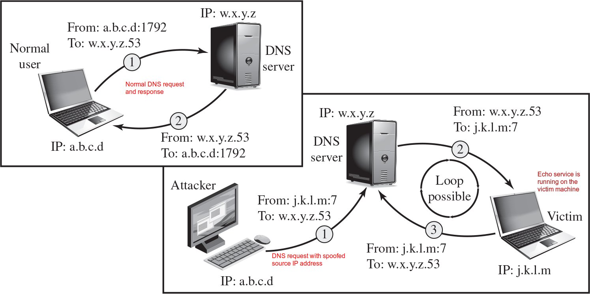

# Denial-of-Service (DoS) Attack

🔭 Explore
---
- [Top 10 DDoS Attacks](https://socradar.io/top-10-ddos-attacks/)


[What is Denial-of-Service Attack?](https://en.wikipedia.org/wiki/Denial-of-service_attack)
---
- The [NIST Computer Security Incident Handling Guide](https://csrc.nist.gov/pubs/sp/800/61/r2/final) defines DoS attack as
- An action that 
  - prevents or impairs the authorized use of networks, systems, or applications 
  - by exhausting resources such as computing capability, memory, bandwidth, and disk space
    - *with large volume of malicous requests*
  - *also known as a cyberslam*
- simple to setup, difficult to stop, and very effective
- Popular form
  - Distributed denial-of-service (DDoS) attack


DoS attack targets
---
- Network bandwidth
  - The capacity of the network links connecting a server to the Internet
  - For most organizations this is their connection to Internet Service Provider (ISP)
- System resources
  - temporary buffers used to hold arriving packets
  - tables of open connections
  - and similar memory data structures
  - *can be crashed with poison packets if the system is vulnerable*
    - *such as [ping of death](https://en.wikipedia.org/wiki/Ping_of_death) and [teardrop attacks](https://en.wikipedia.org/wiki/Denial-of-service_attack#Teardrop_attacks) crash Windows 9x*
- Application resources
  -  capability of accepting client connections
  -  capability of carrying out database operations
  -  *can be crashed if the application is vulnerable* 


Flooding attack with [ping flood](https://en.wikipedia.org/wiki/Ping_flood)
---
- A classic denial-of-service attack
- Overwhelm the capacity of the network connection to the target organization
- Traffic can be handled by higher capacity links on the path
  - but packets are discarded as capacity decreases
- Source of the attack is clearly identified 
  - unless a spoofed address is used
- Network performance is noticeably affected


Source Address Spoofing in Flooding attacks
---
- Forge large volumes of IP packets with random source addresses different from the attacker $A$
  - Usually via the raw socket interface on operating systems
  - Makes $A$ harder to be identified
  - The destination address is set to be the target system $T$
- The ICMP echo responses from $T$ will not be reflected back to $A$
  - For the forged addresses, 
    - some correspond to real systems, they respond with error packets to $T$
    - some not used or unreachable, then ICMP destination unreachable packets might be sent back to $T$ or discarded
    - These returned packets form a second wave of attack on $T$
    - Congestion could occur in the router connected to $T$


Countermeasures against flooding attacks
---
- require flow information along the path from $A$ to $T$
  - it takes time and effort to organize
- this vulnerability born with TCP/IP 
  - which assumes a cooperative, trusting environment
  - no assurance about the source address in a packet really corresponds with the sender $S$
    - impose filtering on routers to ensure this, needs to be imposed
       - as close to $S$ as possible
       - at the borders of the ISP’s providing this connection 
         - unfortunately, many ISPs do not implement such filtering
- [Honeypot](https://en.wikipedia.org/wiki/Honeypot_(computing)) exploits a useful side effect of this scattering of response packets
  - monitors attack traffic for unused IP addresses in backscatter traffic
  - gives valuable information on the type and scale of attacks 


TCP SYN Spoofing attack overview
---
- A common classic DoS attack
- Exhausts the table of open connections of a TCP server so 
  - it can not respond to future connection requests
  - Thus legitimate users are denied access to the server
- Targets the network handling code in the application and the operating system


TCP Three-Way Connection Handshake
---


TCP SYN Spoofing Attack Inside
---

- If the SYN-ACK is sent to an existant system, it will respond with a RST packet to cancel this unknown connection request
  - The server removes the corresponding table entry once it received the RST packet
- Overloading the TCP open connection table is successful
  - No need of large volume of SYN spoof packets
  - But consistent attack is needed since the server will remove a table entry after several times of resend


---


💡 Demo
---
- [Step By Step Procedure To Configure IIS On The Windows Server](https://thesecmaster.com/step-by-step-procedure-to-configure-iis-on-the-windows-server/)
- [SYN Flooding](https://github.com/Samsar4/Ethical-Hacking-Labs/blob/master/9-Denial-of-Service/1-SYN-Flooding.md)
  - Launch SYN flooding against Windows server from Parrot
    ```bash
    # 0. find services on Windows server
    nmap -A WindowsIP

    # ATTN: Launch the three attacks below one by one
    # 1. Attack IIS with Metasploit auxiliary module synflood
    msfconsole
    msf> use auxiliary/dos/tcp/synflood
    synflood> options
    synflood> set RHSOT WindowsIP
    synflood> set RPORT 80
    synflood> set SHOST SpoofIP
    synflood> run

    # 2. Perform SYN flooding using hping3
    hping3 -S WindowsIP -a KarrotIP -p 80 --flood

    # 3. Perform ping food
    ping -f WindowsIP
    ```
  - Examine the DoS Attack on Windows server for each attack above
    - Install [Wireshark](https://www.wireshark.org/)
    - Analyze DoS traffics with Wireshark
    - Check Performance tab on Task Manager


Flooding Attacks
---
- Overload the network capacity on some link to a server
  - the server gets too busy handling flooding packets to accept authorized users
- Virtually any type of network packet can be used
  - better choose allowed types to avoid being filtered
- Popular types classified based on network protocol used
  - ICMP (Internet Control Message Protocol) flood
  - UDP (User Datagram Protocol) flood
  - TCP (Transmission Control Protocol) SYN flood


Popular flooding attacks
---
- [ICMP](https://en.wikipedia.org/wiki/Internet_Control_Message_Protocol) flood
  - Ping flood, one of the ICMP floods, uses ICMP echo request packets
    - Traditionally allowed for network diagnosis, disabled recently
  - Critical ICMP packet types are still needed for the correct operation of TCP/IP, such as
    -  ICMP destination unreachable
    -  time exceeded (timeout) packets 
    -  these packets can be exploited for ICMP flood attacks
- [UDP](https://en.wikipedia.org/wiki/User_Datagram_Protocol) flood
  - directs UDP packets to any port number on the target system
    - responses will be generated on serving ports
    - attack packets are dropped on non-serving ports
    - Spoofed source addresses are normally used
- [TCP SYN flood](https://en.wikipedia.org/wiki/SYN_flood)
  - Sends large volume of TCP packets to the target system
  - Similar to the SYN spoofing attack 
    - but the goal is flooding the links to the server


How to increase the DoS attack scale?
---
- Using a single system to attack is easier to trace
- Use multiple systems to launch large-scale attacks
  - Distributed denial-of-service attacks
  - Reflector attacks
  - Amplifier attacks


Distributed Denial of Service (DDoS) Attacks
---
- Use multiple systems to launch attacks
  - usually through [botnet](https://en.wikipedia.org/wiki/Botnet)
- by command and control (C&C) software


DDoS Attack Architecture
---

- the layered control structure obscures the path back to the attacker


How to increase DoS attack effect?
---
- Exploit resource-consuming operations that are disproportionate to the attack effort
- Two protocols that suffer from such attacks
  - SIP (Session Initiation Protocol) flood
  - HTTP (Hypertext Transfer Protocol) flood


[SIP](https://en.wikipedia.org/wiki/Session_Initiation_Protocol) flood
---
- SIP can be used for initiating, maintaining, and terminating communication sessions in [VoIP (Voice over IP)](https://en.wikipedia.org/wiki/Voice_over_IP)
  - a text-based protocol with syntax similar to that of HTTP
  - has two types of messages: requests and responses
- The request SIP INVITE Initiates a dialog for establishing a call
  - 
  - a single INVITE request triggers considerable resource consumption
     - exploited by SIP flood attack
- SIP flood attacks a SIP proxy with numerous INVITE requests with spoofed IP addresses
  - deplete the proxy's capability of processing the INVITE requests
  - exhaust the network bandwith
- Even worse, VoIP server has the INVITE of Death vulnerability (https://en.wikipedia.org/wiki/INVITE_of_Death)
  - can be crashed completely with a single malformed packet


HTTP-targeted Attacks
---
- [HTTP flood](https://en.wikipedia.org/wiki/HTTP_Flood)
  - Bombards Web servers with HTTP requests
    - Consumes considerable resources by requesting to download large files
  - Spidering
    - Bots start from webpage by a given HTTP link, access all links on this webpage recursively
- [Slowloris](https://en.wikipedia.org/wiki/Slowloris_(computer_security))
  - Attempts to monopolize all of the available request handling threads on the Web
server 
    - by sending HTTP requests that never complete to keep the connection alive
      - these requests have no header delimiter, a blank line
    - The Web server keeps the connection open, expecting more information to complete the request
      - Eventually consumes Web server’s connection capacity
  - Utilizes legitimate HTTP traffic
    - not recognized by signature-based intrusion detection and prevention systems   
  - Countermeasure of delay binding with a load balancer 
    - checks the completeness of HTTP request header
    - only forward complete HTTP request to web server


🔭 Explore
---
- [Tribe Flood Network](https://en.wikipedia.org/wiki/Tribe_Flood_Network)
- [High Orbit Ion Cannon](https://en.wikipedia.org/wiki/High_Orbit_Ion_Cannon)
- [Low Orbit Ion Cannon](https://en.wikipedia.org/wiki/Low_Orbit_Ion_Cannon)


💡 Demo
---
- [DDoS attack using HOIC](https://github.com/Samsar4/Ethical-Hacking-Labs/blob/master/9-Denial-of-Service/2-DDoS-using-HOIC.md)
- Attack Parrot from Windows server
  - On Windows server, download and install [High Orbit Ion Cannon](https://en.wikipedia.org/wiki/ High_Orbit_Ion_Cannon) on Windows Server
    - Run HOIC and add the target as Parrot
      - URL: http://ParrotIP
      - Power: high
      - Booster: GenericBoost.hoic
    - THREADS: 30
    - FIRE THE LAZER!
  - On Parrot analyze the attack with Wireshark
    ```bash
    # 1. launch a simple HTTP server
    python3 -m http.server 80
    # 2. access from Windows: http://ParotIP
    ```


Reflection Attacks
---
- Attacker sends packets to a known service on the intermediary with a spoofed source address of the target system
  - the response from intermediary is sent to the target
  - the attack is reflected off the intermediary (reflector)
- Goal is to generate enough volumes of packets to flood the link to the target system without alerting the intermediary
  - Method 1: any accessible UDP service could be exploited for this goal, such as
    - [chargen (Character Generator Protocol)](https://en.wikipedia.org/wiki/Character_Generator_Protocol)
    - [DNS (Domain Name System)](https://en.wikipedia.org/wiki/Domain_Name_System)
    - [SNMP (Simple Network Management Protocol)](https://en.wikipedia.org/wiki/Simple_Network_Management_Protocol)
    - [ISAKMP (Internet Security Association and Key Management Protocol)](https://en.wikipedia.org/wiki/Internet_Security_Association_and_Key_Management_Protocol)
  - Method 2: TCP SYN packets with spoofed source address can be exploited as well
    - Any accessible TCP service can be used for this goal
  - Method 3:  establishes a self-contained loop between the intermediary and the target system
    - easy to filter because the combinations of service ports should never occur in normal network operation



- The intermediary systems are often chosen to be 
  - high-capacity network servers or 
  - routers with very good network connections
- The basic defense against reflection attacks is blocking spoofed-source packets


Amplification Attacks
---
- 

- a variant of reflector attacks
- differ in generating multiple response packets for each spoofed packet sent
  - achieved by directing the original request to broadcast addresses, such as
    - [Smurf attack](https://en.wikipedia.org/wiki/Smurf_attack) uses ICMP echo request packets
    - fraggle attack, a variant of Smurf attack, exploits UDP service
  - Broadcasts are inherently connectionless so TCP services can't be used
- Defense
  - disallow directed broadcasts to be routed into a network from outside
  - limit network services such as echo and ping from being accessed from outside


[DNS Amplification Attacks](https://www.cisa.gov/news-events/alerts/2013/03/29/dns-amplification-attacks)
---
- Use packets directed at a legitimate DNS server as the intermediary system
- create a series of DNS requests with spoofed source address of the target system
- Exploit DNS behavior to convert a small request to a much larger response (amplification)
  -  a 60-byte UDP request packet can result in a 512-byte UDP response
  -  the extended DNS protocol allows much larger responses of over 4000 bytes
- A further variant of this attack exploits open recursive DNS name servers
  - these servers support recursion by default for any requests
- Defense
  - prevent the use of spoofed source addresses
  - configure DNS servers appropriately


Defenses Against Denial-of-Service Attacks
---
- Cannot be prevented completely
- High traffic volumes may be legitimate
  - High publicity about a specific site
  - Activity on a very popular site
  - Described as slashdotted, flash crowd, or flash event
- Four lines of defense against DDoS attacks
  - Attack prevention and preemption
    - Before attack
  - Attack detection and filtering
    - During the attack
  - Attack source traceback and identification
    - During and after the attack
  - Attack reaction
    - After the attack


DoS Attack Prevention
---
- [Block spoofed source addresses](https://datatracker.ietf.org/doc/html/rfc2827)
  - On routers as close to source as possible
- Filters may be used to ensure path back to the claimed source address is the one being used by the current packet
  - Filters must be applied to traffic before it leaves the ISP’s network or at the point of entry to their network
- Use modified TCP connection handling code to  defend against the SYN spoofing attack
  - Cryptographically encode critical information in a [cookie](https://en.wikipedia.org/wiki/SYN_cookies) that is sent as the server’s initial sequence number
    - Legitimate client responds with an ACK packet containing the incremented sequence number cookie
  - Drop an entry for an incomplete connection from the TCP connections table when it overflows
    - known as selective drop or random drop
- best defense against broadcast amplification attacks
  - Block IP directed broadcasts
  - Block suspicious services and combinations
- Manage application attacks with 
  - a form of graphical puzzle (captcha) to distinguish legitimate human requests
- Good general system security practices
  - Use mirrored and replicated servers when high-performance and reliability is required


Responding to Denial-of-Service Attacks
---
- Good Incident Response Plan
  - Details on how to contact technical personal and ISP
  - Needed to impose traffic filtering upstream
  - Details of how to respond to the attack
- Antispoofing, directed broadcast, and rate limiting filters should have been implemented
- Ideally have network monitors and IDS to detect and notify abnormal traffic patterns
- Identify type of attack
  - Capture and analyze packets
  - Design filters to block attack traffic upstream
  - Or identify and correct system/application bug
- Have ISP trace packet flow back to source
  - May be difficult and time consuming
  - Necessary if planning legal action
- Implement contingency plan
  - Switch to alternate backup servers
  - Commission new servers at a new site with new addresses
- Update incident response plan
  - Analyze the attack and the response for future handling


💡 Demo
---
- [Detecting DoS Attack traffic](https://github.com/Samsar4/Ethical-Hacking-Labs/blob/master/9-Denial-of-Service/3-Detecting-DoS-Traffic.md)
- On Windows server
  - Download and install [KFSensor](http://www.keyfocus.net/kfsensor/) and [Wireshark](https://www.wireshark.org/)
  - Run KFSensor and setup DoS options
- On Karrot
  ```bash
  # 1. check if port 80 is open on Windows
  nmap -p 80 WindowsIP
  # 2. Launch SYN flooding attack against Windows IIS
  hping3 -d 100 -S -p 80 --flood WindowsIP
  # 3. go back to Windows and see it becomes almost irresponsive
  # which means the related resources of Windows are completely exhausted. 
  # This means that the DoS attack is being successfully performed
  # 4. In Parrot, press CTRL+C to stop hping3
  ```
- Go back to Windows
  - check that KFSensor detected the DoS attack
  - analyze packet dump from KFSensor with Wireshark


# References
- [CISA DDoS quick guide](https://www.cisa.gov/sites/default/files/publications/DDoS%20Quick%20Guide.pdf)
- [Configure IIS Web Server on Windows Server 2019](https://computingforgeeks.com/install-and-configure-iis-web-server-on-windows-server/)
- [Ethical-Hacking-Labs/9-Denial-of-Service](https://github.com/Samsar4/Ethical-Hacking-Labs/tree/master/9-Denial-of-Service)
- [Ethical-Hacking-Labs/8-Social-Engineering](https://github.com/Samsar4/Ethical-Hacking-Labs/tree/master/8-Social-Engineering)