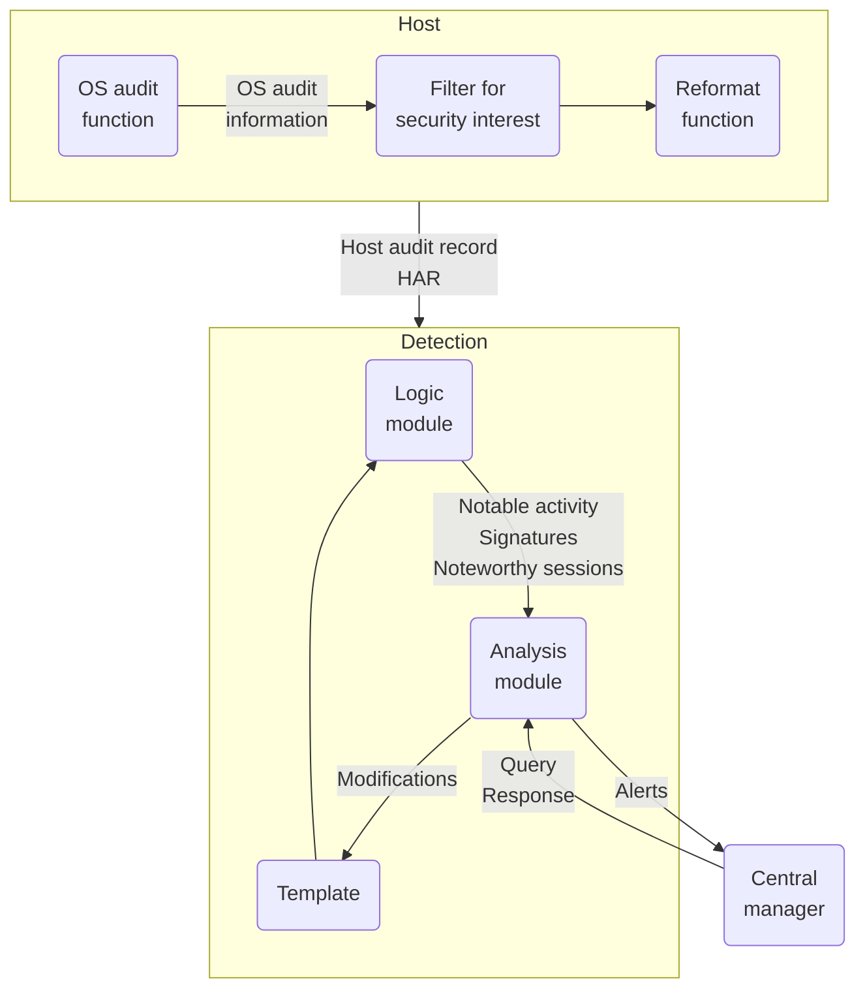
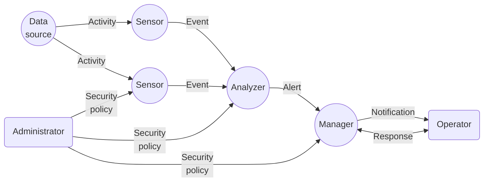
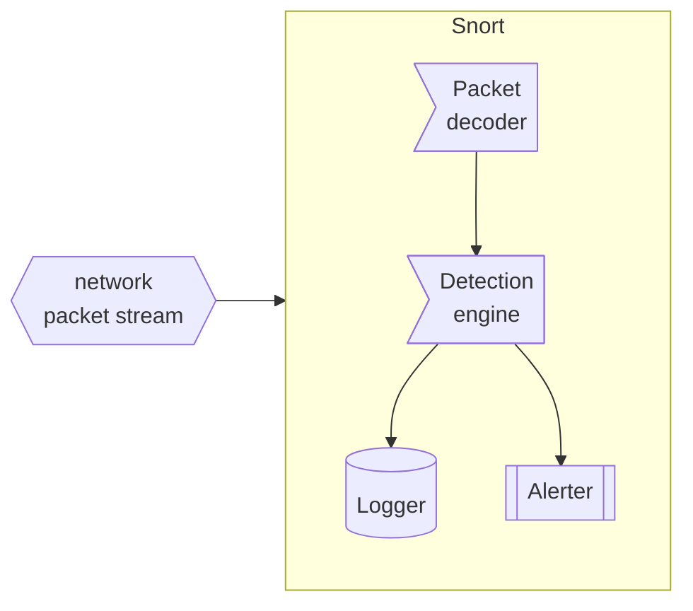

# Intrusion Detection
CSPP ch8


Objectives
---
- Recognize intrusion patterns
- Describe intrusion detection
  - principles and requirements
  - approaches
- Exploit honeypots and Snort


🔭 Explore
---
- [Attackers: List of computer criminals](https://en.wikipedia.org/wiki/List_of_computer_criminals)
- [Attacks: List of security hacking incidents](https://en.wikipedia.org/wiki/List_of_security_hacking_incidents)
- [Aftermath: List of data breaches](https://en.wikipedia.org/wiki/List_of_data_breaches)
- [Defense: United States Cyber Command (USCYBERCOM)](https://en.wikipedia.org/wiki/United_States_Cyber_Command)


[Intruders](https://en.wikipedia.org/wiki/Security_hacker)
---
- trespass IT systems through
  - unauthorized logon or access to machines
  - malware
- also known as hackers, crackers, or computer criminals
- explore methods for breaching defenses 
- exploit weaknesses in a computer system or network
- motivated by profit, protest, challenge, recreation, etc.
- classified into several categories based on motivations
  - Cyber criminals
  - Hacktivists
  - State-sponsored organizations
  - Miscellaneous

Cyber criminals
---
- pursue financial reward
- typical [cybercrimes](https://en.wikipedia.org/wiki/Cybercrime):
  - Identity theft
  - Theft of financial credentials
  - Corporate espionage
  - Data theft and ransoming
- trade malware, stolen data and identities
- coordinate attacks on the internet
- meet in underground forums, [dark webs](https://en.wikipedia.org/wiki/Dark_web) hosted on [darknet](https://en.wikipedia.org/wiki/Darknet) through [Tor](https://en.wikipedia.org/wiki/Tor_(network))


[Hacktivists](https://en.wikipedia.org/wiki/Hacktivism)
---
- motivated by social or political causes
- promote and publicize their causes typically through:
  - Website defacements and redirects
  - Denial of service attacks
  - Theft and distribution of data that results in negative publicity or compromise of their targets


🔭 Explore
---
- [WikiLeaks](https://en.wikipedia.org/wiki/WikiLeaks)
- [Timeline of events associated with Anonymous](https://en.wikipedia.org/wiki/Timeline_of_events_associated_with_Anonymous)


State-sponsored organizations
---
- conduct espionage or sabotage activities
- sponsored by governments such as
  - Russia, USA, UK, and their intelligence allies
- Also known as Advanced Persistent Threats (APTs) due to 
  - the covert nature and persistence over extended periods


Miscellaneous
---
- motivated by technical challenge, peer-group esteem and reputation, etc.
- many of them discovered new categories of buffer overflow vulnerabilities
- some are hobby hackers using attack toolkits to explore system and network security


Three qualitative skill levels of intruders
---
- Apprentices:
  - Also known as “script-kiddies”
  - comprise the largest number of intruders
  - primarily use existing attack toolkits
  - have rudimentary technical skills
- Journeymen:
  - have sufficient technical skills 
  - able to 
    - modify and extend attack toolkits to 
      - exploit newly discovered or purchased vulnerabilities
    - locate and exploit vulnerabilities similar to the known
  - Adapt tools for use by others
- Masters:
  - have high-level technical skills
  - be able to 
    - discover new vulnerabilities
    - Write new powerful attack toolkits
  - Some are employed by state-sponsored organizations


🔭 Explore
---
- [Cyber attack phases and countermeasures](https://en.wikipedia.org/wiki/Kill_chain)
  1. Reconnaissance
  2. Weaponization
  3. Delivery
  4. Exploitation
  5. Installation
  6. Command and Control
  7. Actions on Objective
- [Types of cyber attack](https://en.wikipedia.org/wiki/Cyberattack)
- Find the cyber attacks for each phase


[Intrusion Detection](https://en.wikipedia.org/wiki/Intrusion_detection_system)
---
- security intrusion: 
  - Unauthorized act of bypassing the security mechanisms of a system
- intrusion detection: 
  - A hardware or software function 
  - gathers and analyzes information from various areas within a computer or a network 
  - identifies ­ possible security intrusions


Intrusion Detection System (IDS) components
---
- Sensors
  - collect evidences of an intrusion such as
    - network packets, log files, and system call traces
    - file integrity checksums, registry access
- Analyzers
  - aggregate the evidences
  - determine whether an intrusion has occurred
  - provide guidance about reactions to the intrusion
- User interfaces let users
  - view reports
  - configure and control the behavior of the system


Basic Principles for IDS
---
- Quick detection
  - better detect the intrusion before any damage or compromise
- Serving as a deterrent to intruders
- Collecting intrusion techniques to improve future detection
- Based on the assumption that the intruder behavior is different from legitimate user
  - the decision is based on a set of criteria
    - looser criteria lead to more false positives
    - stricter criteria lead to more false negatives 
- It is challenging to achieve a high rate of detections with a low rate of false alarms
  - a limit imposed by the nature of probabilities [base-rate fallacy](https://en.wikipedia.org/wiki/Base_rate_fallacy)
  - when the numbers of intrusions is far less than the number of legitimate uses


🔭 Explore
---
- [The requirements of IDS](https://www.mitre.org/sites/default/files/pdf/intrusion_lapadula.pdf)
- List the requirements on processing, function, output, technique and miscellaneousness


Intrusion Analysis Approaches
---
- Anomaly Detection
  - get patterns of legitimate behavior over a period of time
  - intrusion typically deviates from normal *behavior patterns*
  - based on defined normal or expected behavior 
- Signature-based Detection
  - compare current observed data with a set of known malicious *data patterns*
- Heuristic Detection
  - compare current observed data with a set of known malicious *attack rules*
- The last two approaches are also called misuse detection
  - based on defined malicious patterns and rules
- Anomaly detection typically has higher level of false alarm than misuse detection
  - but is slower and more inefficient


[IDS Anomaly Detection](https://en.wikipedia.org/wiki/Anomaly-based_intrusion_detection_system)
---
- develops the model of normal behavior before hand and evolves continuously
- typical ways to develop the models
  - statistical models such as univariate, multivariate, or time-series models
  - knowledge-based models based on a set of rules defining legitimate behavior
  - machine-learning models trained and verified with historical datasets


Machine-learning approaches for anomaly detection
---
- Bayesian networks
- Markov models
- Neural networks
- Fuzzy logic
- Genetic algorithms
- Clustering and outlier detection


🔭 Explore
---
- [Statistical model](https://en.wikipedia.org/wiki/Statistical_model)
- [Knowledge-based systems](https://en.wikipedia.org/wiki/Knowledge-based_systems)
- [Machine learning](https://en.wikipedia.org/wiki/Machine_learning)


Signature or Heuristic Detection
---
- Signature approaches
  - Match observed data against a large collection of known signatures of malicious data
  - The signatures need to be large enough to cover the scale of malicious data
  - Widely used in anti-virus products and NIDS
- Rule-based heuristic identification
  - Use rules to identify known attacks or penetrations
    - also to identify suspicious behavior
  - rules are typically specific to the machine and operating system
  - SNORT is an example of a rule-based NIDS


🔭 Explore
---
- [What is Signature-Based Detection?](https://corelight.com/resources/glossary/signature-based-detection)


IDS types classified by deployment
---
- Host-based IDS (HIDS)
- Network-based IDS (NIDS)
- Distributed or hybrid IDS


[Host-based IDS (HIDS)](https://en.wikipedia.org/wiki/Host-based_intrusion_detection_system)
---
- Installed on a single host
  - add a layer of security
- monitors and analyzes 
  - the internals of the host such as
    - system call traces
      - typically through [os hooks](https://en.wikipedia.org/wiki/Hooking)
      - hard to apply on Windows due to the extensive use of DLLs
    - memory access
    - hardware access
    - registry access, specific to Windows
  - the network packets on its network interfaces


🔭 Explore
---
- [Linux System call](https://en.wikipedia.org/wiki/System_call)
  - [Searchable Linux Syscall Table for x86 and x86_64](https://filippo.io/linux-syscall-table/)
  - [strace: a diagnostic, debugging and instructional userspace utility for Linux](https://strace.io/)
- [Windows API](https://en.wikipedia.org/wiki/Windows_API) 
  - [Windows API index](https://learn.microsoft.com/en-us/windows/win32/apiindex/windows-api-list)
  - [Sysinternals](https://learn.microsoft.com/en-us/sysinternals/)


💡 Demo
---
- [Install and Configure Tripwire on Ubuntu](https://computingforgeeks.com/install-and-configure-tripwire-on-ubuntu/)
- [Process Explorer](https://learn.microsoft.com/en-us/sysinternals/downloads/process-explorer)
  - [Process Monitor](https://learn.microsoft.com/en-us/sysinternals/downloads/procmon)
- [TCPView](https://learn.microsoft.com/en-us/sysinternals/downloads/tcpview)
- [Sysmon](https://learn.microsoft.com/en-us/sysinternals/downloads/sysmon)


A general agent architecture
---


Network-based IDS (NIDS)
---
- Installed on routers or edge firewalls
- Comprised of 
  - a number of sensors, including two types
    - inline sensor with traffic pass through
    - passive sensor eavesdrop traffic
  - one or more servers for NIDS management functions 
  - one or more management consoles for the human interface
- Monitors and analyzes pass-through network traffic in real or close to real time
- May examine protocol activities on all network layers
- Analysis of traffic patterns may be done at 
  - the sensor, the management server or 
  - a combination of the two


Distributed or hybrid IDS
---
- Combines information from a number of sensors, 
  - often both host (host agent module) and 
  - network (LAN monitor agent module) based, 
- feeds in a central analyzer (central manager module)
- able to better identify and respond to intrusion activities


Intrusion Detection Techniques
---
- Defined and exemplified in [NIST SP 800-94: Guide to Intrusion Detection and Prevention Systems (IDPS) section 2.3](https://csrc.nist.gov/pubs/sp/800/94/final)
- Attack examples and suitable detection technique

| Detection tech | Attacks |  
| --- | --- | 
| Signature detection | ▶️Reconnaissance and attacks on all network layers<br>▶️Unexpected application services<br>▶️Policy violations |
| Anomaly Detection | ▶️Denial-of-service (DoS) attacks<br>▶️Scanning<br>▶️Worms |


Stateful Protocol Analysis (SPA)
---
- Defined in [NIST SP 800-94 section 2.3](https://csrc.nist.gov/pubs/sp/800/94/final)
- A subset of anomaly detection 
  - compares observed network traffic against *predetermined universal vendor supplied profiles of benign protocol traffic*
  - but anomaly techniques trained with organization specific traffic protocols
- Stateful means it understands and tracks network, transport, and application protocol states to ensure they progress as expected
- A key disadvantage is resource consuming


Typical information logged by a NIDS sensor
---
- Timestamp
- Connection or session ID
- Event or alert type
- Rating  (e.g., priority, severity, impact, confidence)
- Network, transport, and application layer protocols
- Source and destination IP addresses
- Source and destination TCP or UDP ports, or ICMP types and codes
- Number of bytes transmitted over the connection
- Decoded payload data, such as application requests and responses
- State-related information


Distributed or Hybrid Intrusion Detection
---
- Distributed systems cooperate to identify intrusions and adapt to
changing attack profiles
- an example: autonomic enterprise security system
- Usually consists of
  - a central IDS inputs three types of events
    - *summary events* summarize information collected from network segments
    - *Distributed detection and inference (DDI) events* alert that an attack is under way
    - *Policy enforcement points (PEPs) events* show intrusions synthesized from distributed information
  - multiple HIDS and NIDS
- Integrate [security information and event management (SIEM) software](https://en.wikipedia.org/wiki/Security_information_and_event_management)
- share information


IETF Intrusion Detection Working Group
---
- defines data formats and exchange procedures for sharing information of interest to intrusion detection, response systems and management systems
  - [Intrusion Detection Exchange Format (IDMEF)](https://en.wikipedia.org/wiki/Intrusion_Detection_Message_Exchange_Format) defined in [RFC 4765](https://www.ietf.org/rfc/rfc4765.txt)
  - The Intrusion Detection Exchange Protocol (IDXP) defined in [RFC 4767](https://www.ietf.org/rfc/rfc4767.txt)
  - Intrusion Detection Message Exchange Requirements defined in [RFC 4766](https://www.ietf.org/rfc/rfc4766.txt)


Intrusion Detection Message Exchange Requirements
---
- defines requirements for the Intrusion Detection Message Exchange Format (IDMEF)
- specifies requirements for a communication protocol for IDMEF


The Intrusion Detection Message Exchange Format
---
- describes a data model to represent the information exported by IDS 
  - explains the rationale for using this model
- presents an implementation of the data model in Extensible Markup Language (XML)
  - develops XML Document Type Definition (DTD), 
  - provides examples


The Intrusion Detection Exchange Protocol
---
- describes the Intrusion Detection Exchange Protocol (IDXP), 
  - an application level protocol for exchanging data between intrusion detection entities
- IDXP supports mutual authentication, integrity, and confidentiality over a connection oriented protocol


A general model for IDME
---

- Data source
  - network packets, OS/application audit logs, etc.
- Sensor
  - Collects data from the data source
  - forwards events to the analyzer
- Analyzer
  - analyze data for signs of intrusion
- Administrator
  - The human with overall responsibility for setting the security policy of the organization
- Manager
  - The IDS component or process from which the operator manages the various components of the IDS
- Operator
  - The human that is the primary user of the IDS manager


🔭 Explore
---
- [The Best SIEM Tools for 2023: Vendors & Solutions Ranked](https://www.comparitech.com/net-admin/siem-tools/)
- [10 Open Source SIEM Tools](https://logz.io/blog/open-source-siem-tools/)


[Honeypots](https://en.wikipedia.org/wiki/Honeypot_(computing))
---
- Decoy systems designed to
  - Lure a potential attacker away from critical systems
  - Collect information about the attacker’s activity
  - Encourage the attacker to stay on the system long enough for administrators to respond
- Systems are filled with fabricated information that a legitimate user of the system wouldn’t access
- Resources that have no production value
  - Therefore incoming communication is most likely a probe, scan, or attack
  - Initiated outbound communication suggests that the system has probably been compromised
- typical deployment locations relative to corporation network
  - outside the external firewall
  - the DMZ (demilitarized zone) for outward services such as web and mail
  - inside the corporate network


Honeypot Classifications
---
- Low interaction honeypot
  - Consists of a software package that emulates particular I T services or systems well enough to provide a realistic initial interaction, but does not execute a full version of those services or systems
  - Provides a less realistic target
  - Often sufficient for use as a component of a distributed I D S to warn of imminent attack
- High interaction honeypot
  - A real system, with a full operating system, services and applications, which are instrumented and deployed where they can be accessed by attackers
  - Is a more realistic target that may occupy an attacker for an extended period
  - However, it requires significantly more resources
  - If compromised could be used to initiate attacks on other systems


🔭 Explore
---
- [A list of awesome honeypots](https://github.com/paralax/awesome-honeypots)
- [Honeypots: 30 low-high level honeypots in a single PyPI package](https://github.com/qeeqbox/honeypots)
- [T-Pot: The All In One Multi Honeypot Platform](https://github.com/telekom-security/tpotce)


🔭 Explore popular open-source IDS/IPS
---
- [Host-based intrusion detection system comparison](https://en.wikipedia.org/wiki/Host-based_intrusion_detection_system_comparison)
- [Snort: the foremost Open Source Intrusion Prevention System (IPS)](https://www.snort.org/)
- [Suricata: an open source IDS and IPS](https://suricata.io/)
- [Zeek: An Open Source Network Security Monitoring Tool](https://zeek.org/)
- [Kismet: a sniffer, WIDS, and wardriving tool for Wi-Fi, Bluetooth, Zigbee, RF, and more, which runs on Linux and macOS](https://www.kismetwireless.net/)
- [the samhain file integrity / host-based intrusion detection system](https://www.la-samhna.de/samhain/)
- [OSSEC (Open Source HIDS SECurity): a free, open-source host-based intrusion detection system (HIDS)](https://www.ossec.net/)
- [Sagan:  an open source high performance, real-time log analysis & correlation engine](https://github.com/quadrantsec/sagan)


[Snort: the foremost Open Source Intrusion Prevention System (IPS)](https://www.snort.org/)
---
- a libpcap-based packet sniffer/logger
  - features rules-based logging
- can be used as a lightweight network intrusion detection system
  - can perform content searching/matching in addition to  detecting a variety of other attacks and probe, such as 
    - buffer overflows, stealth port scans, 
    - CGI attacks, SMB probes, and much more
- has a real-time alerting capability, with alerts being sent to
  - syslog, a separate "alert" file, or even to a Windows computer via Samba


Snort Architecture
---

- set NIC to *promiscuous* mode to capture all passing packets
- Packet decoder
  - decodes captured packet to get protocol headers of each network layer
- Detection engine
  - analyzes each packet based on a set of rules
  - determine if the packet matches the characteristics defined by a rule
- Logger
  - the rule specifies what logging and alerting options are to be taken for matched packets
- Alerter
  - generates alerts for matched packets
  - what information is included in the event notification is specified by the rule


🔭 Explore
---
- [Snort 2 vs. Snort 3](https://www.snort.org/snort3)
- [Use Snort 3](https://docs.snort.org/)


[Snort 2 rule formats](http://manual-snort-org.s3-website-us-east-1.amazonaws.com/node27.html)
---
```snort
[action][protocol][sourceIP][sourcePort]->[destIP][destPort]([Rule options])
```
- A sample Snort rule
  ```snort
  alert tcp any any -> 10.0.2.0/24 100 \
  (content:"|00 01 86 a5"; msg:"mountd access";)
  ```
- Most Snort rules are written in a single line
  - rules may span multiple lines by adding a backslash \ to the end of the line
- Consists of two logical sections: rule header ( zero or more rule options)
  - [the rule header](http://manual-snort-org.s3-website-us-east-1.amazonaws.com/node29.html) contains
    - the rule's action
      - 3 default actions: alert, log, pass
      - 3 inline mode actions: drop, reject, sdrop
    - protocol such as TCP, UDP, ICMP and IP
    - source and destination IP addresses
    - the source and destination ports  
  - [the rule options](http://manual-snort-org.s3-website-us-east-1.amazonaws.com/node30.html) contains
    - in the format of: keyword:"value";
    - alert messages 
    - information on which parts of the packet should be inspected to determine if the rule action should be taken
    - the options form a logical AND statement
- the various rules in Snort rules library files form a large logical OR statement


Snort rule actions
---
| action | description |
| --- | --- |
| alert | generate an alert using the selected alert method, and then log the packet |
| log | log the packet |
| pass | ignore the packet |
| drop | block and log the packet |
| reject | block the packet, log it, and then send a TCP reset if the protocol is TCP or an ICMP port | unreachable message if the protocol is UDP |
| sdrop | block the packet but do not log it |


🔭 Explore
---
- [Snort rule options](http://manual-snort-org.s3-website-us-east-1.amazonaws.com/node30.html)


💡 Demo
---
- Play with [Snort: the foremost Open Source Intrusion Prevention System (IPS)](https://www.snort.org/)
  - Go through Snort 2 Users Manual
  - Go through Snort 3 Users Manual


🖊️ Practice
---
- Play with [Suricata](https://suricata.io/)


# References
- [Writing Snort Rules with Examples and Cheat Sheet](https://cyvatar.ai/write-configure-snort-rules/)
- [Tcpdump & libpcap](https://www.tcpdump.org/)
- [WinPcap: The industry-standard windows packet capture library](https://www.winpcap.org/)
- [Npcap: Packet capture library for Windows](https://npcap.com/)
- [Windows API tutorial](https://zetcode.com/gui/winapi/)
  - [Winprog: premier Windows Programming](http://www.winprog.org/)
- [Windows API Hooking](https://www.ired.team/offensive-security/code-injection-process-injection/how-to-hook-windows-api-using-c++)