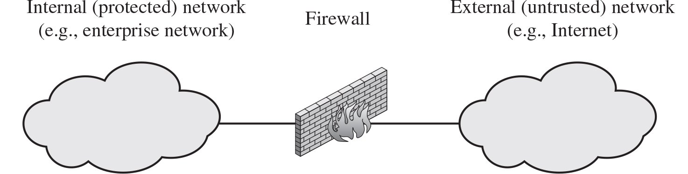
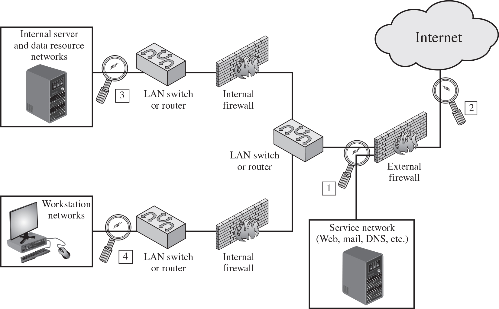
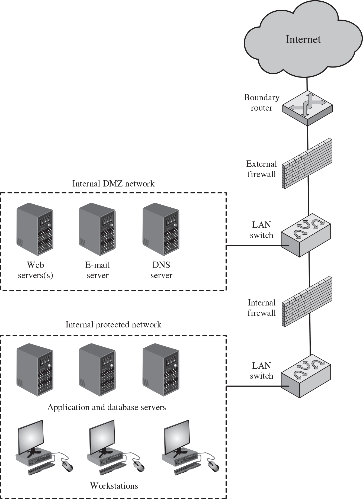
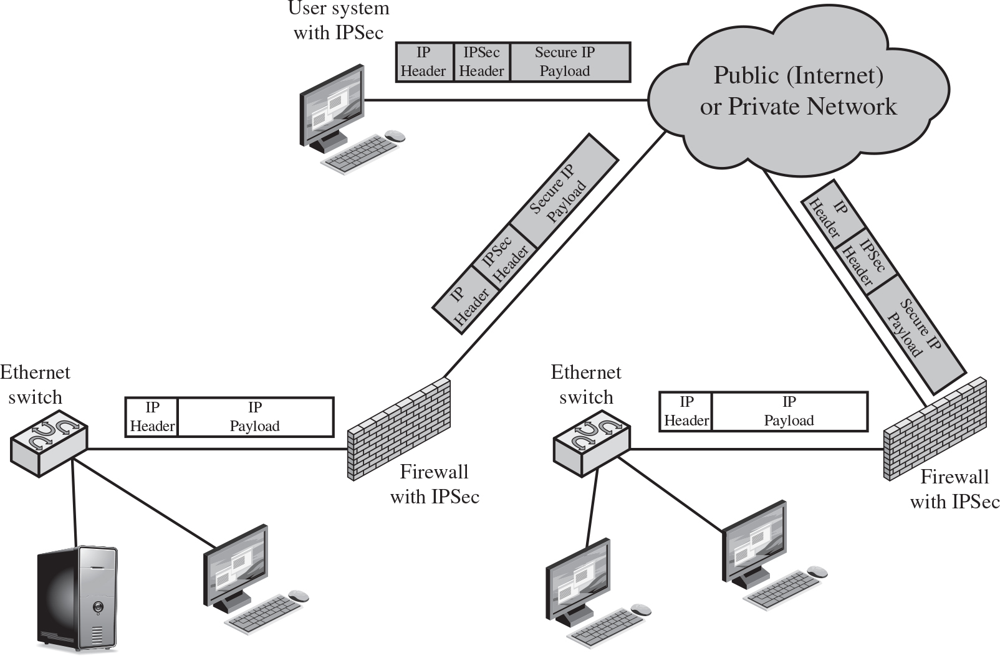
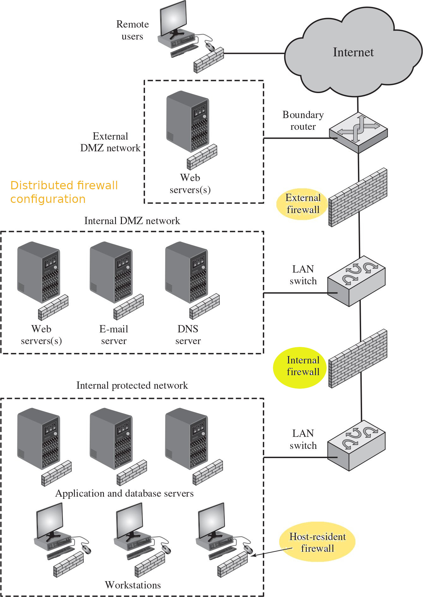
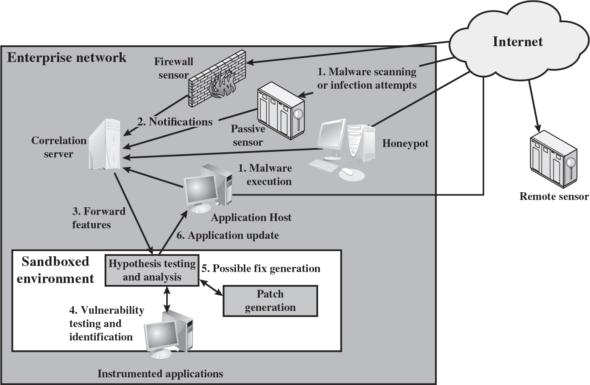
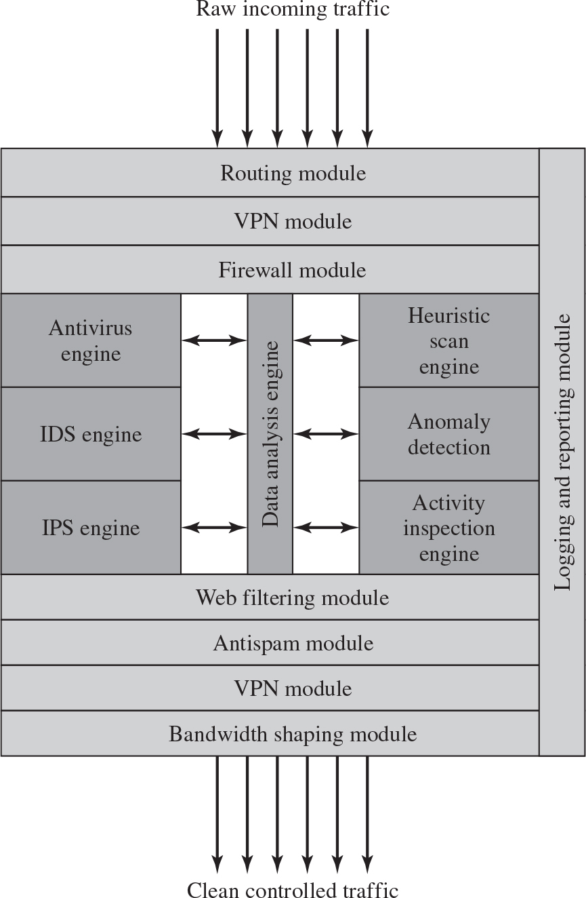

# Antivirus, Firewalls and Intrusion Prevention Systems
CSPP ch9


🔭 Explore
---
- [What is an antivirus?](https://en.wikipedia.org/wiki/Antivirus_software)
  - [Comparison of antivirus software](https://en.wikipedia.org/wiki/Comparison_of_antivirus_software)


🖊️ Practice
---
- [Explore Windows security](https://www.microsoft.com/en-us/windows/comprehensive-security)
- [Explore, download and install ClamAM on Windows](https://www.clamav.net/)


🦮 Guide
---
- [NIST SP 800-83: Guide to Malware Incident Prevention and Handling for Desktops and Laptops](https://csrc.nist.gov/pubs/sp/800/83/r1/final)


🔭 Explore
---
- [What is a firewall?](https://en.wikipedia.org/wiki/Firewall_(computing))


Defense in depth
---
- Most organizations have internet connectivity today
  - threats are introduced
- Effective *means* of protecting LANs are needed
  - the means could be IDS, IPS, IDPS, firewall, or combined
  - Inserted between the organization network and the Internet to establish a controlled link
    - Used as a perimeter defense
    - Single choke point to impose security and auditing
    - Insulates the internal systems from external networks
  - Can be a single computer system or a set of two or more systems working together


Firewall design goals
---
- All traffic between inside and outside must pass through the firewall
  - Only traffic authorized by security policy will be allowed to pass
- The firewall is immune to penetration


Firewall Access Policy
---
- A critical component in firewall planning and implementation
  - lists the types of traffic authorized to pass through the firewall
    - based on address ranges, protocols, applications and content
- developed from 
  - the organization’s information security risk assessment and policy
  - a broad specification of allowed traffic types
- refined to detail the network traffic filters


Network traffic characteristics used by firewall filters
---
- IP address and protocol values
  - used by packet filter and stateful inspection firewalls
  - Typically used to limit access to specific services
- Application protocol
  - used by an application-level gateway that relays and monitors the exchange of information for specific application protocols such as checking
    - SMTP email for spam
    - HTTP web requests to authorized sites
- User identity
  - Typically for inside users who identify themselves using some form of secure authentication technology
- Network activity
  - request timestamp, request rate, or other activity patterns


Firewall Capabilities And Limits
---
- Capabilities:
  - Defines a single choke point for simplified and centralized management
    - Provides a location for monitoring, auditing and alarming security events
    - Integrates other Internet functions such as NAT, DNS, DHCP, etc.
  - Can serve as the platform for IPSec and VPN
- Limitations:
  - Cannot protect against attacks bypassing firewall such as 
    - backdoor
    - unmonitored mobile broadband connections
  - May not protect fully against internal threats
  - Improperly secured wireless LAN can be accessed from outside the organization
  - Infected laptop, smart phones, or portable storage device may be used internally


Types of Firewalls based on inspected network level
---
- packet filtering firewall
  - inspect packet individually
- stateful inspection firewall
  - inspect all packets of a transport connection
- application proxy firewall
  - inspect details of application protocol
- circuit-level proxy firewall
  - such as SOCKS Circuit-Level Gateway
- The choice of which level is appropriate is determined by the desired firewall access policy


Two types of filters
---
- Positive filter
  - based on normal behavior
  - allows to pass only packets that meet specific criteria
- Negative filter
  - based on abnormal behavior
  - rejects any packets that meet certain criteria


[Packet Filtering Firewall](https://en.wikipedia.org/wiki/Berkeley_Packet_Filter)
---
- Applies rules to each incoming and outgoing IP packet
  - rules are based on matches in the IP or TCP header
  - Forwards or discards the packet based on rule match
- Filtering rules are based on information contained in a network packet such as
  - Source and destination IP address
  - Source and destination port number
  - IP protocol fields
  - mac address specified interface
- Two default policies:
  - Discard - prohibit unless expressly permitted
    - More conservative, controlled, visible to users
  - Forward - permit unless expressly prohibited
    - Easier to manage and use but less secure


🖊️ Practice
---
- [Best practices for configuring Windows Defender Firewall](https://learn.microsoft.com/en-us/windows/security/operating-system-security/network-security/windows-firewall/best-practices-configuring)
- [How to Use UFW (Uncomplicated Firewall)?](https://www.baeldung.com/linux/uncomplicated-firewall)
  - [How To Configure Firewall with UFW on Ubuntu 20.04 LTS](https://www.cyberciti.biz/faq/how-to-configure-firewall-with-ufw-on-ubuntu-20-04-lts/)
  - [UFW](https://help.ubuntu.com/community/UFW)


🏃 Exercise
---
- Allow web service only on Windows server
- Allow ssh service only in Parrot Linux


Packet Filter Advantages And Weaknesses
---
- Advantages
  - Simplicity
  - Typically transparent to users and are very fast
- Weaknesses
  - Cannot prevent attacks that employ application specific vulnerabilities or functions
  - Limited logging functionality
  - Do not support advanced user authentication
  - Vulnerable to attacks on TCP/IP protocol bugs
  - Improper configuration can lead to breaches
    - have to permit inbound network traffic on source ports 1024 to 65535 used by clients


Attacks on packet filter and countermeasures
---
| attack | countermeasure |
| --- | --- |
| *IP address spoofing attacks* spoof source ip addresses of intrusion packets as internal hosts | discard packets with inside source address but arrives on an external interface |
| *Source routing attacks* specify the route in a packet to bypass firewall | discard all packets that use this option |
| *Tiny fragment attacks* divide TCP header information into separate fragment using IP fragmentation option | enforce a rule that the first fragment of a packet must contain a predefined minimum amount of the transport header |


---


Stateful Inspection Firewall
---
- Tightens rules for TCP traffic by creating a directory of outbound TCP connections
  - There is an entry for each currently established connection
  - Packet filter allows incoming traffic to high numbered ports only for those packets that fit the profile of one of the entries in this directory
- Reviews packet information but also records information about TCP connections
  - Keeps track of TCP sequence numbers to prevent attacks that depend on the sequence number
  - Inspects data for protocols like [FTP](https://en.wikipedia.org/wiki/File_Transfer_Protocol), [IM](https://en.wikipedia.org/wiki/Instant_messaging) and [SIP](https://www.siptutorial.net/) commands


💡 Demo
---
- Show network status in user space
  ```bash
  netstat -h
  ss -h
  ```
- [How to configure iptables on Ubuntu](https://www.fosslinux.com/96275/how-to-configure-iptables-on-ubuntu.htm)
  - [Iptables How To](https://help.ubuntu.com/community/IptablesHowTo)
- [conntrack - command line interface for netfilter connection tracking](https://manpages.ubuntu.com/manpages/lunar/en/man8/conntrack.8.html)
  - [user manual](http://conntrack-tools.netfilter.org/manual.html)


Application-Level Gateway
---
- Also called an [application proxy](https://en.wikipedia.org/wiki/Proxy_server)
  - Acts as a relay of application-level traffic
  - User contacts gateway using a TCP/IP application
  - User is authenticated
  - Gateway contacts application on remote host and relays TCP segments between server and user
- Must have proxy code for each application
  - May restrict application features supported
- Tend to be more secure than packet filters
- Disadvantage is the additional processing overhead on each connection


[Circuit-Level Gateway](https://nordlayer.com/learn/firewall/circuit-level/)
---
- [Circuit level proxy](https://en.wikipedia.org/wiki/Circuit-level_gateway)
  - Sets up two TCP connections, one between itself and a TCP user on an inner host and one on an outside host
  - Relays TCP segments from one connection to the other without examining contents
  - Security function consists of determining which connections will be allowed
- Typically used when inside users are trusted
  - May use application-level gateway inbound and circuit-level gateway outbound
  - Lower overheads


SOCKS Circuit-Level Gateway
---
- [SOCKSv5](https://en.wikipedia.org/wiki/SOCKS) defined in [RFC1928](https://datatracker.ietf.org/doc/html/rfc1928)
- Designed to provide a framework for client-server applications in TCP/UDP domains to conveniently and securely use the services of a network firewall
- Client application contacts SOCKS server, authenticates, sends relay request
  - Server evaluates and either establishes or denies the connection
- Components
  - SOCKS server runs on firewall
  - SOCKS client library runs on internal hosts protected by the firewall
  - SOCKS-ified client applications


🔭 Explore
---
- [Shadowsocks: A fast tunnel proxy that helps you bypass firewalls](https://shadowsocks.org/)


Firewall basing
---
- bastion host
- host-based firewall
- network device firewall
- virtual firewall
- personal firewall


[Bastion Host](https://en.wikipedia.org/wiki/Bastion_host)
---
- System identified as a critical strong point in the network’s security
- Serves as a platform for an application-level or circuit-level gateway
- Common characteristics:
  - Runs secure OS, only essential services
    - May require user authentication to access proxy or host
  - Each proxy can restrict features, hosts accessed
  - Each proxy is small, simple, checked for security
  - Each proxy is independent, non-privileged
  - Each proxy maintains detailed audit information
  - Limited disk use, hence read-only code


[Host-Based Firewalls](https://nordlayer.com/learn/firewall/host-based/)
---
- Used to secure an individual host
- Available in OS or can be installed as an add-on package
- Filter and restrict packet flows
- Common location is a server
- Advantages:
  - Filtering rules can be tailored to the host environment
  - Protection is provided independent of topology
  - Provides an additional layer of protection


🔭 Explore
---
- [What Is a Host-Based Firewall? Ultimate Guide](https://www.enterprisenetworkingplanet.com/security/host-based-firewall/)


[Personal Firewall](https://en.wikipedia.org/wiki/Personal_firewall)
---
- a software module on a personal computer
- Controls traffic between a personal computer or workstation and the Internet or enterprise network
  - For both home or corporate use
- Can be housed in a router that connects all of the home computers to a DSL, cable modem, or other Internet connection
- Typically much less complex than server-based or stand-alone firewalls
- Primary role is to deny unauthorized remote access
- May also monitor outgoing traffic to detect and block worms and malware activity


💡 Demo
---
- Firewall locations and configurations (source: cspp figure 8.5 and 9.2)
- 
  - Single bastion inline
- 
  - Double bastion T
- 
  - Double bastion inline
- A [VPN](https://en.wikipedia.org/wiki/Virtual_private_network) Security Scenario (source: cspp figure 9.3)
  - [Internet Protocol Security (IPsec)](https://en.wikipedia.org/wiki/IPsec)
  - [ipsec vpn deployments](https://datatracker.ietf.org/meeting/interim-2017-i2nsf-01/materials/slides-interim-2017-i2nsf-01-sessa-ipsec-vpn-deployments-paul-wouters-00)
- 
- Example Distributed Firewall Configuration (source: cspp figure 9.4)
- 
  - Distributed firewall configuration


Summary of Firewall Locations and Topologies
---
- Host-resident firewall
  - Includes personal firewall software and firewall software on servers
- Screening router
  - Single router between internal and external networks with stateless or full packet filtering
- Single bastion inline
  - Single firewall device between an internal and external router
- Single bastion T
  - similar to single bastion inline
  - but has a third network interface on bastion to a DMZ where externally visible servers are place
- Double bastion inline
  - DMZ is sandwiched between bastion firewalls
- Double bastion T
  - DMZ is on a separate network interface on the bastion firewall
- Distributed firewall configuration
  - Used by large businesses and government organizations


🔭 Explore
---
- [Comparison of firewalls](https://en.wikipedia.org/wiki/Comparison_of_firewalls)


🦮 Guide
---
- [NIST SP 800-41: Guidelines on Firewalls and Firewall Policy](https://csrc.nist.gov/pubs/sp/800/41/r1/final)
- [Top 10 Best Open-Source Firewall to Protect Your Enterprise Network 2023](https://cybersecuritynews.com/best-open-source-firewall/)
- [9 Best Next-Generation Firewall (NGFW) Solutions for 2023](https://www.esecurityplanet.com/products/top-ngfw/)
- [Top 10 Firewall Hardware Devices in 2022](https://www.spiceworks.com/it-security/network-security/articles/top-10-firewall-hardware-devices/)


---


🔭 Explore
---
- [What is an IDPS?](https://en.wikipedia.org/wiki/Intrusion_detection_system)


Intrusion Prevention Systems (IPS)
---
- Also known as Intrusion Detection and Prevention System (IDPS)
- extends IDS to block or prevent detected malicious activity
- Can be host-based, network-based, or distributed/hybrid
- can modify or block traffic as a firewall does but based on IDS rules
  - usually considered as another form of firewall


Host-Based IPS (HIPS)
---
- based on signature/heuristic or anomaly detection techniques
  - Signature/heuristic based: 
    - focus on specific content of 
      - application network traffic
      - sequences of system calls
    - look for patterns that have been identified as malicious
  - Anomaly based: 
    - look for behavior patterns that indicate malware
  - types of malicious behaviors:
    - Modification of system resources
    - Privilege-escalation exploits
    - Buffer-overflow exploits
    - Access to e-mail contact list
    - Directory traversal


HIPS
---
- A set of general purpose tools used for desktop or server system
- Capability can be tailored to protect specific platform
  - such as Web server and database server
  - looks for particular application attacks
- Can use a sandbox approach
  - suited to mobile code such as Java applets and scripting languages
  - runs the code and monitors its behavior in an quarantined system area
- typically offers desktop protection in:
  - System calls
  - File system access
  - System registry settings
  - Host input/output


The Role of HIPS
---
- enterprise desktop and laptop are among the main targets for hackers and criminals
- Traditionally, endpoint security has been provided by a collection of products such as 
  - antivirus, antispyware, antispam, and personal firewalls
- It is attractive to provide an integrated single-product suite of functions
  - Advantages 
    - various tools work closely together 
    - threat prevention is more comprehensive 
    - management is easier
- A prudent approach
  - use HIPS as one element in a defense-in-depth strategy 
  - with network-level devices such as firewalls and network-based IPSs


Network-Based IPS (NIPS)
---
- essentially an Inline NIDS with authority to 
  - modify or discard packets 
  - tear down TCP connections
- Uses signature/heuristic detection and anomaly detection such as
  - Pattern matching
  - Stateful matching
  - Protocol anomaly
  - Traffic anomaly
  - Statistical anomaly
- Provides flow data protection
  - reassembles application payload in a sequence of packets
  - then applies filters to the full content of the flow


🔭 Explore
---
- [Top 10 Intrusion Detection And Prevention Systems](https://www.clearnetwork.com/top-intrusion-detection-and-prevention-systems/)


Digital Immune System (DIS)
---
- A representative of distributed or hybrid IPS
- Comprehensive defense against worms detected on their malicious behavior
- Motivation for this development
  - the rising threat of Internet-based worms 
  - the increasing speed of their propagation provided by the Internet 
  - the need to acquire a global view of the situation
- Success depends on the ability of the DIS to detect new worms


💡 Demo
---
- 
  - Placement of Malware Monitors


🖊️ Practice
---
- [Snort 3](https://www.snort.org/)
  - [Snort 3 Rule Writing Guide](https://docs.snort.org/)


[Unified threat management (UTM)](https://en.wikipedia.org/wiki/Unified_threat_management)
---
- integrates into one box with multiple security modules such as
  - antivirus, IDS, IPS, firewall, patch generation, system update
  - and non-security modules such as 
    - management of users, hardware and software
    - log, audit, analysis and report
- 
  - Now typically called [next-generation firewall (NGFW)](https://en.wikipedia.org/wiki/Next-generation_firewall)
- Sidewinder G2 Security Appliance


🔭 Explore
---
- [Compare Unified Threat Management Software](https://www.g2.com/categories/unified-threat-management-utm)
- [open source ngfw best of all times top 5](https://syncbricks.com/top-5-best-free-ngfw-firewall/)
- [How to Build your Own Next-Generation Firewall (NGFW) at Home?](https://www.zenarmor.com/docs/network-security-tutorials/how-to-build-ngfw-for-home#what-are-the-system-requirements-for-installing-the-next-generation-firewall)


🦮 Guide
---
- [NIST SP 800-94: Guide to Intrusion Detection and Prevention Systems (IDPS)](https://csrc.nist.gov/pubs/sp/800/94/final)


🔭 Going forward
---
- Explore *concentration courses* of [Information Assurance and Cyber Security](http://catalog.floridapoly.edu/preview_program.php?catoid=31&poid=1351)
  - [ ] CIS 4362 - Applied Cryptography Credits: 3
  - [x] CIS 4367 - Computer Security Credits: 3
  - [ ] CIS 4204 - Ethical Hacking Credits: 3
  - [ ] CIS 4203 - Digital Forensics Credits: 3
- Explore *electives courses* of [Information Assurance and Cyber Security](http://catalog.floridapoly.edu/preview_program.php?catoid=31&poid=1351)
  - [ ] CIS 4369 - Web Application Security Credits: 3
  - [ ] CNT 4409 - Network Security Credits: 3
  - [ ] CEN 4088 - Software Security Testing Credits: 3


# References
- [Computer & Internet Security:A Hands-on Approach](https://www.handsonsecurity.net/)
- [Firewall](https://nordlayer.com/learn/firewall/)
- [SOCKS 5 — A Proxy Protocol](https://medium.com/@nimit95/socks-5-a-proxy-protocol-b741d3bec66c)
  - [SOCKS Proxy Primer: What Is SOCKs5 and Why Should You Use It?](https://securityintelligence.com/posts/socks-proxy-primer-what-is-socks5-and-why-should-you-use-it/)
- [Best 61 Socks5 Proxy Open Source Projects](https://www.opensourceagenda.com/tags/socks5-proxy)
  - [MicroSocks - multithreaded, small, efficient SOCKS5 server](https://github.com/rofl0r/microsocks)
  - [GoProxy](https://github.com/snail007/goproxy)
- [Textbook uses terminology like Double/Single Bastion Inline/T to describe firewall architectures. Are these terms used in professional environments?](https://security.stackexchange.com/questions/240540/textbook-uses-terminology-like-double-single-bastion-inline-t-to-describe-firewa)